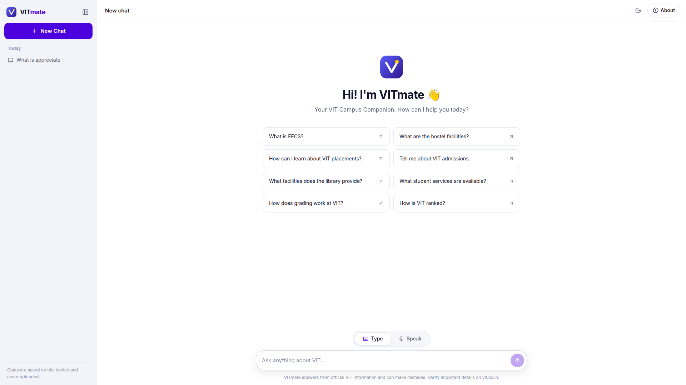
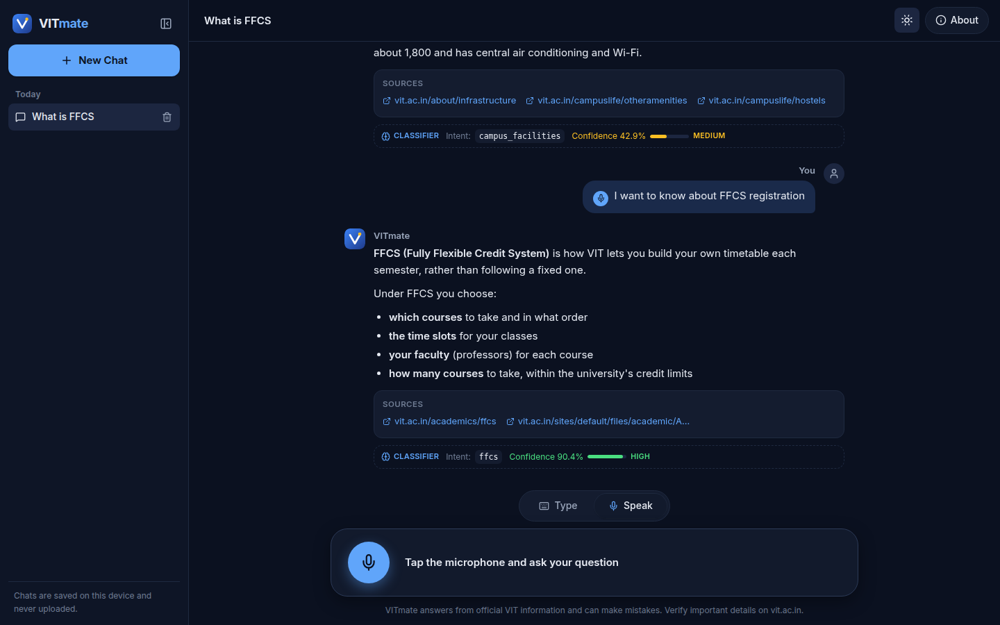
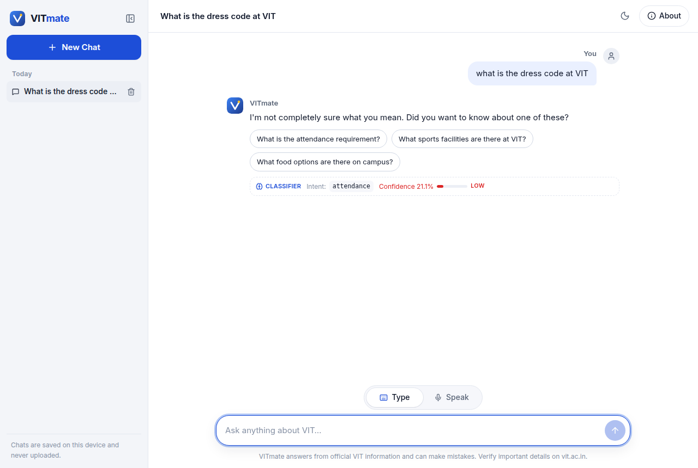
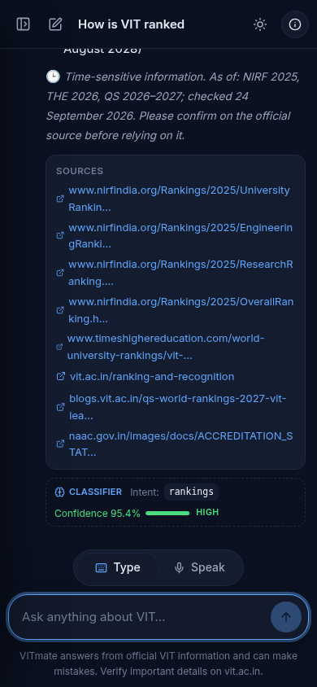
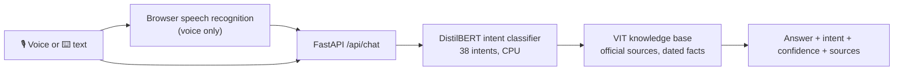

<div align="center">


# VITmate

**Your VIT Campus Companion**

*VITmate: A Voice-Enabled Deep Learning-Based Campus Assistant for VIT*

[](https://vit-mate.vercel.app)


**[🚀 Try VITmate live](https://vit-mate.vercel.app)** | [📖 Documentation](docs/README.md) | [📊 Results](docs/12-results-summary.md)

</div>

---

VITmate is a chatbot for **VIT (Vellore Institute of Technology)** students. You can **type or speak** questions like "What is FFCS?", "What are the hostel facilities?" or "How is VIT ranked?". VITmate understands them with a **fine-tuned deep-learning model** and answers from a curated knowledge base of **official VIT and other authoritative sources**, with links.

> Hi! I'm **VITmate** 👋 — Your VIT Campus Companion. How can I help you today?

<p align="center">
  
</p>

## 🚀 Try it live

**👉 [vit-mate.vercel.app](https://vit-mate.vercel.app)** (free to use, no sign-up)

- Use **Google Chrome** or **Microsoft Edge** to ask questions by voice, and allow the microphone when asked. Typing works in every browser.
- After a quiet period, the first visit can take a few seconds while the model starts up. After that, answers arrive almost instantly.
- Your chats are saved only in your own browser.

## 💡 Why VITmate?

Answers about FFCS rules, attendance, exams, hostels, scholarships, placements or rankings are scattered across many pages and PDFs. VITmate puts them one question away, and it's honest about what it doesn't know: it never invents fees, dates or statistics.

## ✨ Features

<table>
<tr>
<td width="50%" valign="top">

**🎙️ Speak or type**<br/>
Browser speech recognition tolerates natural pauses, and both input methods feed one conversation.

</td>
<td width="50%" valign="top">

**🧠 Real deep learning**<br/>
A fine-tuned DistilBERT (67M parameters) sorts each question into one of 38 intents in about 13 ms on a CPU, chosen by a multi-seed comparison of five approaches.

</td>
</tr>
<tr>
<td valign="top">

**🔍 Transparent**<br/>
Every answer shows the model's **intent and confidence** and its **sources**.

</td>
<td valign="top">

**🤔 Helpful when unsure**<br/>
Instead of guessing, VITmate offers "did you mean…?" topics you can tap.

</td>
</tr>
<tr>
<td valign="top">

**📚 Grounded answers**<br/>
Facts come from official VIT pages, NIRF, THE and NAAC, and time-sensitive ones carry their date.

</td>
<td valign="top">

**💬 Follow-ups work**<br/>
Ask "What is FFCS?", then "How does it work?", and VITmate keeps the topic.

</td>
</tr>
<tr>
<td valign="top">

**🗂️ Chat history on your device**<br/>
Grouped by date, reopen or delete chats, never uploaded.

</td>
<td valign="top">

**🌗 Polished UI**<br/>
Light and dark themes, a responsive layout, keyboard navigation and an About section.

</td>
</tr>
</table>

## 📸 Screenshots

<table>
<tr>
<td align="center"><br/><sub>Welcome screen with suggested questions</sub></td>
<td align="center"><br/><sub>Dark theme</sub></td>
</tr>
<tr>
<td align="center"><br/><sub>"Did you mean…?" for an unclear question</sub></td>
<td align="center"><br/><sub>Mobile layout</sub></td>
</tr>
</table>

## ⚙️ How it works



The neural network decides **what** you're asking about, and the curated knowledge base decides **what VITmate says**, so facts can be corrected without retraining. Details are in the [architecture docs](docs/02-system-architecture.md).

## 📊 Results at a glance

| Metric | Result |
|---|---|
| Test set (339 questions, 38 intents) | accuracy **0.850**, macro-F1 **0.850** |
| Spoken-style questions (120, held out) | accuracy **0.950**, macro-F1 **0.953** |
| Out-of-scope questions correctly declined | **90.6%** of 977 unseen |
| Speed | ~13 ms per question on a laptop CPU |

<p align="center"></p>

Details: [Evaluation](docs/07-evaluation.md) | [Model comparison](docs/05-model-comparison.md) | [Results summary](docs/12-results-summary.md)

## 🧰 Tech stack

| Part | Technology |
|---|---|
| Frontend | React 18, TypeScript, Vite |
| Speech | Browser Web Speech API |
| Backend | Python, FastAPI |
| Model | PyTorch, Hugging Face Transformers (fine-tuned DistilBERT, CPU) |
| Knowledge | Curated YAML with sources (official VIT, NIRF, THE, NAAC) |
| Hosting | Vercel Hobby (free): one Python function serves the API, model and frontend |
| Tests | pytest, Vitest, Testing Library |

## 🖥️ Run it locally

**Requirements:** Python 3.10+, Node.js 18+. No GPU needed.

```bash
git clone https://github.com/js0nnn/VITmate.git
cd VITmate

# 1) Backend: API and model
python3 -m venv .venv && source .venv/bin/activate
pip install -r requirements.txt
uvicorn backend.app.main:app --port 8000

# 2) Frontend (in a second terminal)
cd frontend && npm install && npm run dev
```

Open **http://localhost:5173**. The trained model is included, so no training is needed to run the app.

### 🎤 Voice input

Voice uses the speech recognition **built into your browser**. Use a recent **Google Chrome** or **Microsoft Edge** and allow microphone access. Firefox doesn't provide it, and Brave has the API but no speech service behind it; VITmate detects both and shows a notice. Type mode always works. Pages must be served over `https://` or `localhost`.

## ☁️ Deployment

The live app runs on **Vercel Hobby** at no cost. Every push to `main` deploys a new production version automatically. The ~1 GB function bundle (PyTorch plus the model) uses Vercel's Large Functions. Setup, settings, deployment history and limits are in [docs/10-deployment.md](docs/10-deployment.md).

## 📚 Documentation

The full technical write-up is in **[docs/](docs/README.md)**: architecture diagrams, dataset, model development and comparison, training, evaluation, speech recognition, knowledge base, deployment and limitations.

## 🧪 Tests

```bash
pytest                    # backend, knowledge base, dataset and model
cd frontend && npm test   # UI, speech, persistence
```

## 👤 Project

- **Developer:** B. Jaison Edward | Reg. No. 23BAI0094
- **Live app:** https://vit-mate.vercel.app
- **Repository:** https://github.com/js0nnn/VITmate.git

VITmate is a student lab project and **not an official VIT service**. Always confirm important details on [vit.ac.in](https://vit.ac.in/).

**AI-assisted development:** ChatGPT and Claude were used as professional AI-assisted development tools for architecture planning, implementation support, debugging, documentation, testing and technical review. Project direction, design decisions and final review were carried out by the developer. The chatbot itself calls no external AI service.

**Data credits:** University Chatbot Dataset by Tushar Paul (Apache 2.0); CLINC150 by Larson et al. (CC BY 3.0).
