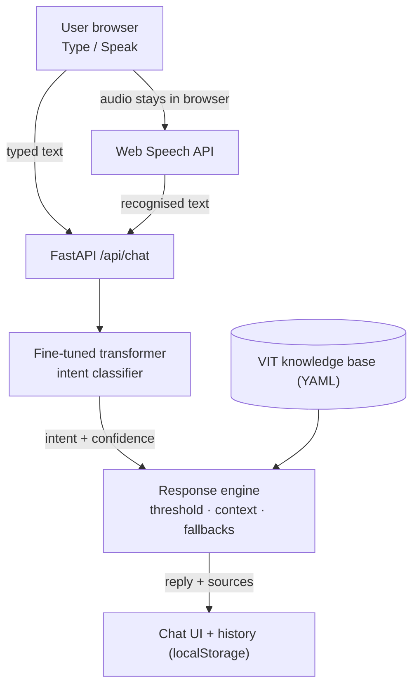

# VITmate — Your VIT Campus Companion

**VITmate: A Voice-Enabled Deep Learning-Based Campus Assistant for VIT**

VITmate is a web chatbot that answers questions about **VIT (Vellore Institute of Technology)**, from FFCS, exams and attendance to hostels, admissions, scholarships and placements. You can **type** or **speak**. Speech is transcribed in the browser. A **fine-tuned transformer** classifies the question into one of 36 intents, and the answer comes from a **knowledge base built from official VIT web pages**, with source links.

> Hi! I'm **VITmate** 👋 — Your VIT Campus Companion. How can I help you today?

*Student lab project by **B. Jaison Edward (Reg. No. 23BAI0094)**. Not an official VIT service.*

---

## Contents

- [Features](#features)
- [Architecture](#architecture)
- [Dataset](#dataset)
- [Model](#model)
- [Results](#results)
- [Speech recognition](#speech-recognition)
- [Knowledge base](#knowledge-base)
- [Running locally](#running-locally)
- [Project structure](#project-structure)
- [Testing](#testing)
- [Demo scenarios](#demo-scenarios)
- [Configuration](#configuration)
- [Deployment readiness](#deployment-readiness)
- [Limitations](#limitations)

## Features

- 🎙️ **Voice input** via the browser's Web Speech API, with a listening animation, live transcript and friendly handling of every error (permission denied, no microphone, silence, network, unsupported browser)
- ⌨️ **Type / Speak segmented control**: two input methods feeding **one** conversation pipeline
- 🧠 **Deep-learning intent classifier**: a fine-tuned transformer (bge-small, 33M parameters, CPU inference in milliseconds), selected by measured validation macro-F1
- 📚 **Grounded answers** from a curated VIT knowledge base. Every answer shows its official source links, and time-sensitive answers ask the user to verify on vit.ac.in
- 🚫 **Out-of-scope detection** ("What is the capital of France?") plus a **confidence threshold** that asks the user to rephrase instead of guessing
- 💬 **Conversation context**: "What is FFCS?" → "How does it work?" is understood as a follow-up about FFCS
- 🗂️ **Conversation history** sidebar (Today / Yesterday / Previous 7 Days / Older) with new chat, restore and delete, persisted in `localStorage`
- 🌗 **Light/dark theme** that follows the system preference on first visit and is then remembered
- ℹ️ **About** dialog, responsive layout (desktop to mobile), keyboard navigation and accessible labels
- 🔍 Each reply shows the **predicted intent and confidence**, which makes the deep-learning component visible during a demo

## Architecture



- **Frontend:** React 18 + TypeScript + Vite
- **Backend:** FastAPI (stateless)
- **Model:** Hugging Face Transformers / PyTorch (CPU)
- **Knowledge base:** YAML

See [docs/architecture.md](docs/architecture.md) for sequence diagrams and a component breakdown.

## Dataset

The dataset is built from three sources (details in [docs/dataset.md](docs/dataset.md)):

| Source | Licence | Role |
|---|---|---|
| [University Chatbot Dataset](https://www.kaggle.com/datasets/tusharpaul2001/university-chatbot-dataset) (Tushar Paul; also distributed by [GTS](https://gts.ai/dataset-download/university-chatbot-dataset/)) | Apache 2.0 | **Foundation**: 39 intents / 412 patterns, remapped to the VIT taxonomy |
| Authored VIT-specific utterances | project | New intents (FFCS, VITEEE, VTOP, ...) and diverse, speech-like paraphrases |
| [CLINC150](https://github.com/clinc/oos-eval) (Larson et al., 2019) | CC BY 3.0 | Out-of-scope examples, extra chit-chat paraphrases, and a held-out OOS test set |

The original dataset was **adapted and extended**, not used as-is:

- intents were kept, merged, split and removed
- all placeholder responses were discarded
- 10 new VIT-specific intents were added
- an `out_of_scope` class was built

The final dataset has **36 intents** and **2,119 labelled examples**, split 70/15/15 into **1,478 train / 322 validation / 319 test**. Paraphrases are grouped so that near-duplicates never cross splits, and no text leaks between splits. There are two more held-out sets: **113 spoken-style queries** and **983 CLINC150 out-of-scope queries**.

## Model

| | |
|---|---|
| Architecture | `BAAI/bge-small-en-v1.5` BERT encoder (12 layers, hidden size 384, 33M parameters) + linear classification head over the `[CLS]` representation (36 classes) |
| Tokenizer | WordPiece (uncased, 30,522 vocabulary), max length 64 |
| Loss | Cross-entropy with inverse-√frequency class weights |
| Optimizer | AdamW (lr 1e-4, weight decay 0.01), linear schedule with 10% warm-up, gradient clipping 1.0 |
| Training | Batch 16, up to 25 epochs, **early stopping** on validation macro-F1 (patience 4); best checkpoint kept |
| Inference | Softmax confidence; below the threshold → "please rephrase". Loaded **once** at startup, CPU only |
| Storage | Weights saved in fp16 (~67 MB) and upcast to fp32 when loaded |

**Why this model?** Five approaches were trained on the same splits: a TF-IDF + logistic-regression baseline and four pretrained transformers from 11M to 66M parameters. The two best were then re-run with three seeds. bge-small had the best validation macro-F1 and stays fast on CPU. See [Results](#results) and [docs/results/model_comparison.md](docs/results/model_comparison.md).

## Results

All numbers below were produced by `python -m training.evaluate` on the deployed model (`backend/trained_model/`, fp16 weights, CPU). Raw outputs are in [docs/results/](docs/results/).

### Final model: bge-small (best epoch 6, validation macro-F1 0.8923)

| Evaluation set | Accuracy | Macro precision | Macro recall | Macro F1 | Weighted F1 |
|---|---|---|---|---|---|
| **Test** (n=319, 36 intents) | 0.8589 | 0.8569 | 0.8603 | **0.8490** | 0.8573 |
| Test, with confidence threshold 0.35 | 0.8589 | 0.8809 | 0.8573 | 0.8596 | 0.8556 |
| **Spoken-style challenge** (n=113, held out) | 0.9558 | 0.9630 | 0.9560 | **0.9552** | 0.9550 |

- **Out-of-scope recall** on 983 unseen CLINC150 out-of-scope queries: **89.9%** with the threshold (85.0% from arg-max alone).
- **Confidence threshold** 0.35, chosen by a sweep on the validation set: 5.1% of in-scope test questions are answered with "please rephrase" instead of a possibly wrong answer.
- **CPU efficiency:** model load 0.15 s (warm file cache); single-query latency median **8.02 ms** (p95 9.17 ms); process memory 684 MB RSS; model size 67.7 MB.
- The weakest intents are `campus_facilities` and `academic_calendar`. They are broad and overlap with dining, transport and clubs. The confusion matrix and all misclassified test examples are in [docs/results/evaluation.md](docs/results/evaluation.md).


### Model comparison

Same splits and training procedure for every model. Selection used **validation macro-F1 only** (mean over 3 seeds for the two finalists).

| Candidate | Seeds | Params (M) | Size fp32 (MB) | Val macro-F1 | Test accuracy | Test macro-F1 | Test weighted-F1 | Spoken accuracy | Spoken macro-F1 | Latency (ms) | Train (s) |
|---|---|---|---|---|---|---|---|---|---|---|---|
| baseline (`TF-IDF (word+char) + Logistic Regression`) | 1 | - | - | 0.8022 | 0.8150 | 0.8178 | 0.8132 | 0.9292 | 0.9274 | 1.08 | 5 |
| bert-mini (`google/bert_uncased_L-4_H-256_A-4`) | 1 | 11.2 | 45.7 | 0.8311 | 0.8245 | 0.8288 | 0.8223 | 0.9558 | 0.9571 | 2.0 | 134 |
| minilm-l6 (`sentence-transformers/all-MiniLM-L6-v2`) | 3 | 22.7 | 91.9 | 0.8741 ± 0.0058 | 0.8809 ± 0.0000 | 0.8820 ± 0.0029 | 0.8757 ± 0.0020 | 0.9558 ± 0.0000 | 0.9557 ± 0.0014 | 4.23 | 190 |
| bge-small (`BAAI/bge-small-en-v1.5`) | 3 | 33.4 | 134.5 | 0.8943 ± 0.0098 | 0.8735 ± 0.0178 | 0.8661 ± 0.0187 | 0.8709 ± 0.0169 | 0.9646 ± 0.0089 | 0.9655 ± 0.0098 | 7.76 | 297 |
| distilbert (`distilbert-base-uncased`) | 1 | 67.0 | 268.9 | 0.8790 | 0.8777 | 0.8654 | 0.8736 | 0.9558 | 0.9584 | 12.75 | 604 |

**Why bge-small?** It had the highest mean validation macro-F1 (the pre-set criterion) and the best spoken-style scores, with an 8 ms CPU latency. MiniLM-L6 scored slightly higher on the test set (0.882 vs 0.866 ± 0.019), but that difference is within bge-small's seed variance, and choosing by test score would leak the test set into model selection. MiniLM-L6 is a sound alternative for hosts with very limited memory. Every transformer beat the TF-IDF baseline, and the largest model (DistilBERT, 67M parameters) was **not** the best, so a larger model wasn't justified.

## Speech recognition

VITmate uses the browser's built-in **Web Speech API** (`SpeechRecognition` / `webkitSpeechRecognition`) with `lang = "en-IN"` and interim results:

1. The user clicks the microphone.
2. The browser asks for permission and shows a listening animation with a live transcript.
3. The final transcript is sent through the **same** `handleSend()` as typed text.
4. It appears in the chat as "🎤 *what you said*", followed by the answer.

VITmate's server never receives audio. (Chrome and Edge do send the audio to their vendor's speech service, so an internet connection is required.) Unsupported browsers such as Firefox get a clear message and a one-click switch to Type mode. Full details, states and the error table are in [docs/speech_recognition.md](docs/speech_recognition.md).

## Knowledge base

`data/knowledge/vit_knowledge.yaml` has one entry per intent, each with a summary, follow-up details, official source URLs, a `time_sensitive` flag and a `last_verified` date. The facts were collected on **24 September 2026** from official pages on vit.ac.in, viteee.vit.ac.in and vtop.vit.ac.in.

Details that change often or couldn't be verified are **deliberately not stated**: fee amounts, placement statistics, library hours, bus timings and HOD names. For those, VITmate links to the official page. The knowledge base is a **static snapshot, not a live mirror of the VIT website**, so update it periodically. Updating needs **no retraining**. See [docs/knowledge_base.md](docs/knowledge_base.md).

## Running locally

**Requirements:** Python 3.10+ (tested on 3.12), Node.js 18+ (tested on 20), about 2 GB of disk for the Python packages. No GPU is needed.

### 1. Backend (API + model)

```bash
cd VITmate
python3 -m venv .venv
source .venv/bin/activate
pip install -r requirements.txt          # installs CPU-only PyTorch

# The trained model is included in backend/trained_model/.
# To rebuild it from scratch:
#   python -m training.build_dataset
#   python -m training.train

uvicorn backend.app.main:app --reload --port 8000
```

Check it: `curl http://localhost:8000/api/health` should return `"model_loaded": true`. Interactive API docs are at http://localhost:8000/docs.

### 2. Frontend

In a second terminal:

```bash
cd VITmate/frontend
npm install
npm run dev
```

Open **http://localhost:5173** in **Google Chrome or Microsoft Edge** (needed for voice input). The Vite dev server forwards `/api` requests to the backend on port 8000.

> On Ubuntu, if `node --version` shows v16 or older, install Node 18+ (for example from NodeSource or with `nvm`) before running `npm install`.

### Single-server mode

```bash
cd frontend && npm run build && cd ..
uvicorn backend.app.main:app --port 8000
```

When `frontend/dist/` exists, FastAPI also serves the built frontend, so the whole app runs at http://localhost:8000.

### ML pipeline commands

| Command | What it does |
|---|---|
| `python -m training.build_dataset` | Merges and cleans the sources, splits train/val/test, writes `data/processed/` |
| `python -m training.compare_models` | Trains the baseline and all transformer candidates and writes `docs/results/model_comparison.md` (≈20 min on a 16-thread laptop CPU) |
| `python -m training.compare_models --only minilm-l6 bge-small --seeds 7 13` | Adds seeds to the comparison (mean ± std) |
| `python -m training.train` | Trains the final model (settings in `training/config.yaml`) into `backend/trained_model/` |
| `python -m training.evaluate` | Computes test / spoken / OOS metrics, confusion matrix, threshold sweep, latency and memory in `docs/results/` |

## Project structure

```text
VITmate/
├── backend/
│   ├── app/
│   │   ├── main.py                 # FastAPI app factory, startup model loading, static frontend
│   │   ├── config.py               # settings from VITMATE_* env vars / .env
│   │   ├── api/                    # routes (health, suggestions, chat) + request/response schemas
│   │   ├── ml/intent_classifier.py # transformer inference (shared with evaluation)
│   │   ├── chatbot/                # response engine + follow-up context handling
│   │   └── knowledge/              # knowledge-base loader
│   ├── trained_model/              # deployed fine-tuned model (config, tokenizer, weights)
│   └── requirements.txt            # runtime-only dependencies
├── frontend/
│   ├── src/
│   │   ├── components/             # Sidebar, Header, ChatView, MessageBubble, Composer, ModeToggle, VoiceInput, AboutModal …
│   │   ├── hooks/                  # useSpeechRecognition, useConversations, useTheme
│   │   ├── services/               # API client, localStorage helpers
│   │   ├── styles/                 # design tokens (light/dark) and component styles
│   │   └── test/                   # Vitest + Testing Library tests
│   └── package.json
├── data/
│   ├── raw/                        # original Kaggle dataset, CLINC150, VIT research notes
│   ├── authored/                   # VITmate utterances + held-out spoken challenge set
│   ├── taxonomy.yaml               # intent definitions and original-tag mapping
│   ├── processed/                  # train/val/test/spoken_test/oos_eval + dataset report
│   └── knowledge/vit_knowledge.yaml
├── training/                       # build_dataset, train, compare_models, evaluate
├── tests/                          # pytest: API, engine, knowledge base, dataset, model
├── docs/                           # architecture, dataset, speech, knowledge base, report material, results/
├── requirements.txt                # full dev environment (API + training + tests)
└── .env.example
```

## Testing

```bash
# Backend + ML (from the project root, with the venv active)
pytest                    # all tests, including the real model and the evaluation script
pytest -m "not model"     # fast unit tests only (a deterministic fake classifier replaces the model)

# Frontend
cd frontend && npm test
```

| Suite | Covers |
|---|---|
| `tests/test_api.py` | health, valid chat, voice and text sharing one pipeline, empty/overlong/malformed input, unknown context, out-of-scope, low confidence, suggestions, engine failure without leaking internals, missing model |
| `tests/test_engine.py` | knowledge retrieval, verification notes, pronoun and continuation follow-ups, topic switches, clarification, low-confidence refusal |
| `tests/test_knowledge_base.py` | every intent answerable; every fact cites an official https VIT source and has a verification date |
| `tests/test_dataset.py` | known labels, no split leakage, every intent in every split, class balance |
| `tests/test_model.py` | model loads, valid intents and confidences, demo queries, follow-up with the real model, evaluation script runs |
| `frontend/src/test/*` | Type→send→reply→persist, context round-trip, backend-down error and retry, new/switch/delete chat, theme persistence, About dialog, suggestions, mode persistence, Type/Speak toggle, voice listening→transcript, microphone blocked, silence, unsupported browser |

## Demo scenarios

| Say or type | Expected |
|---|---|
| What is FFCS? | `ffcs`: explanation of the Fully Flexible Credit System |
| *(then)* How does it work? | follow-up: FFCS details (semesters, minors/honours, branch change) |
| What are the hostel facilities at VIT? | `hostel`: 32 blocks, AC/non-AC rooms, amenities |
| Tell me about VIT placements. | `placements`: CDC process and link to the official tracker |
| What programmes does VIT offer? | `programmes` |
| How can I find information about admissions? | `admissions`: entrance routes and the official portal |
| What facilities does the library provide? | `library`: Periyar EVR Central Library |
| 🎤 "uh what are the hostel facilities at VIT" | the same answer, shown with the 🎤 marker |
| What is the capital of France? | `out_of_scope`: polite refusal |
| asdfgh | out-of-scope or "please rephrase" |

## Configuration

Copy `.env.example` to `.env`. All settings are optional.

| Variable | Default | Purpose |
|---|---|---|
| `VITMATE_ENV` | `development` | `production` hides the API docs |
| `VITMATE_CONFIDENCE_THRESHOLD` | `0.35` | Below this, VITmate asks the user to rephrase (chosen on the validation set) |
| `VITMATE_CORS_ORIGINS` | localhost:5173 | Allowed browser origins |
| `VITMATE_MODEL_DIR`, `VITMATE_KNOWLEDGE_FILE`, `VITMATE_FRONTEND_DIST` | project paths | Relative to the project root |
| `VITMATE_TORCH_THREADS` | unset | Cap CPU threads on small hosts |
| `VITE_API_BASE_URL` (frontend) | empty | Set when the API is on another origin |

## Deployment readiness

Hosting is **not** configured yet, but the code is ready for it:

- There are no absolute paths, no GPU requirement and no server-side state (conversation context round-trips through the client), and no database is needed.
- One process can serve both the API and the built frontend. This fits free tiers such as Hugging Face Spaces, Render or Railway.
- The model is CPU-only and the fp16 checkpoint is about 67 MB. The Python process used about 0.7 GB of RAM (RSS) in the measured evaluation.

Remaining steps for hosting:

1. Choose a host.
2. Add a Dockerfile or start command: `npm run build` followed by `uvicorn backend.app.main:app --host 0.0.0.0 --port $PORT`.
3. Set `VITMATE_ENV=production` and `VITMATE_CORS_ORIGINS`.
4. Serve over **HTTPS**. Browsers only allow microphone access on secure origins.

## Limitations

- The knowledge base is a static snapshot (24 September 2026). Dynamic data such as fees, dates and placement numbers is linked, not stated.
- One intent per message. Compound questions ("fees and hostel rules?") get an answer for the dominant intent.
- Context handling is lightweight: one topic, pronoun rewriting, one level of follow-up detail.
- Voice input depends on browser support (best in Chrome and Edge) and on the browser vendor's speech service.
- The training data is partly authored. Real student queries would further improve robustness.
