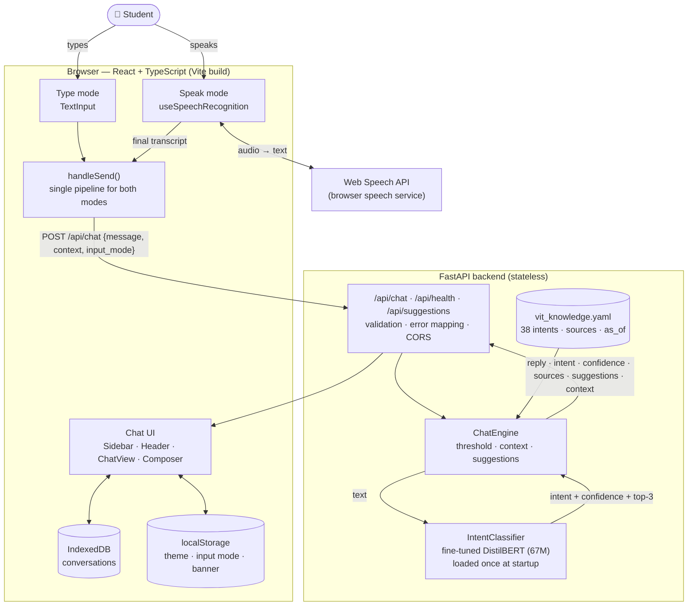
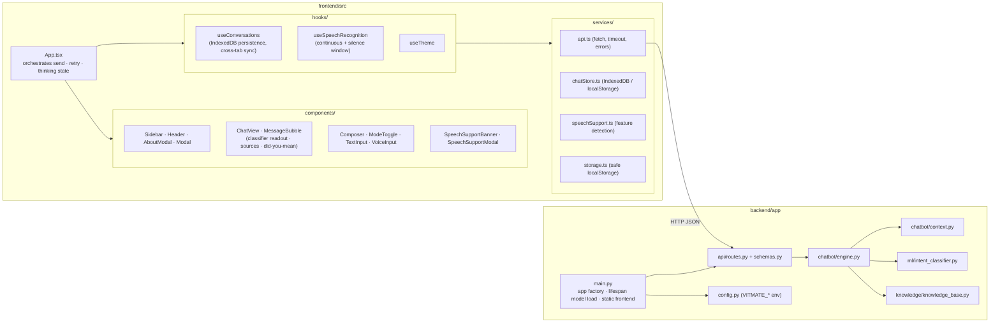
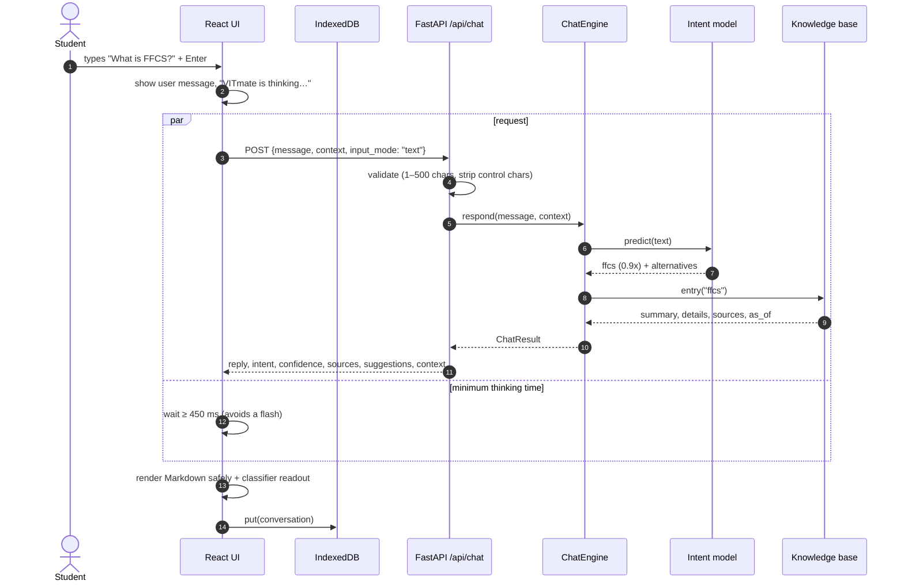
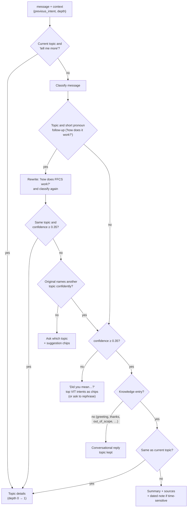
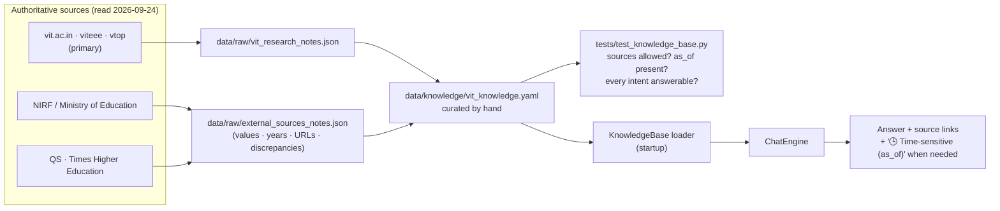
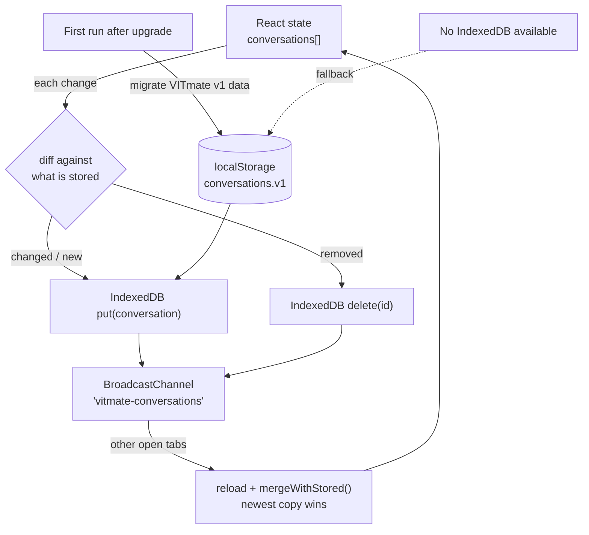

# 02 · System Architecture

VITmate has three parts:

1. a **browser client** (React) that handles typing, speech recognition and locally persisted chat history
2. a **stateless Python API** (FastAPI) that runs the deep-learning intent classifier and the response engine
3. a **curated knowledge base** (YAML) of official VIT and other authoritative information

The design keeps two jobs apart. The neural network decides *what* the user is asking about, and the knowledge base decides *what VITmate answers*. Facts can therefore be corrected without retraining, and the model never has to memorise facts.

## 1. Overall system

## 2. Frontend and backend modules

## 3. Text interaction

## 4. Response-engine decisions

Every message, typed or spoken, goes through the same decision flow in `ChatEngine.respond()`:

The server keeps **no session state**. Each reply returns `context = {previous_intent, depth}`, the browser stores it with the conversation, and it's sent back with the next message. The API therefore scales horizontally and survives restarts.

## 5. Knowledge and data flow

## 6. Chat-history persistence

- **Storage:** one record per conversation in the `vitmate` IndexedDB database (object store `conversations`). The record holds every message with its intent, confidence, sources, suggestions and input mode, plus the conversation context.
- **Survives:** refreshes, browser restarts and reopening the site. `navigator.storage.persist()` is requested so the browser is less likely to evict the data.
- **Never** sent to a server. Private windows and clearing site data remove it.
- **Two tabs** never overwrite each other. Only changed conversations are written, and other tabs merge by `updatedAt`.

## Components

| Layer | Location | Responsibility |
|---|---|---|
| Speech recognition | `frontend/src/hooks/useSpeechRecognition.ts`, `services/speechSupport.ts` | Feature detection; continuous recognition with a silence window; mapping each error code to a message |
| Chat UI | `frontend/src/components/*` | Sidebar history, Type/Speak control, thread, thinking indicator, classifier readout, About, compatibility banner |
| Persistence | `frontend/src/services/chatStore.ts`, `hooks/useConversations.ts` | IndexedDB conversations; `localStorage` preferences |
| API | `backend/app/api/` | Endpoints, validation, error mapping |
| Intent model | `backend/app/ml/intent_classifier.py` | Loads the fine-tuned transformer once; returns intent, confidence and alternatives |
| Context | `backend/app/chatbot/context.py` | Detects follow-ups and rewrites pronouns with the current topic |
| Response engine | `backend/app/chatbot/engine.py` | Threshold, routing, suggestions, freshness notes |
| Knowledge base | `data/knowledge/vit_knowledge.yaml`, `backend/app/knowledge/` | Curated facts with sources and dates |

## Frontend design

- **Layout:** a ChatGPT-inspired chat layout that copies no brand. A collapsible history sidebar (a drawer below 900 px), a header with the theme toggle and About, the thread, and a composer with the animated **Type / Speak** segmented control.
- **Messages:** user bubbles on the right. Assistant replies have an avatar and safe Markdown (raw HTML is never rendered), source links, a **classifier readout** (intent, confidence with a meter and a High/Medium/Low label), and "did you mean" chips on unsure replies.
- **Thinking state:** "VITmate is thinking…" with animated dots is shown for at least 450 ms (never longer than the real request) in both Type and Speak modes.
- **Themes:** light and dark themes use CSS custom properties; the system preference is used on first visit and the choice is then remembered.
- **Accessibility:** semantic landmarks, ARIA labels, a live region for the thread, visible focus rings, keyboard-operable controls, focus-trapped dialogs and reduced-motion support.
- **About:** developer and registration number, GitHub repository link, and the AI-assisted-development acknowledgement.

## Backend design

- **Startup:** FastAPI app factory (`create_app`). The model and knowledge base are loaded **once** in the lifespan hook. If loading fails, `/api/health` reports `degraded` and `/api/chat` returns a friendly 503 instead of crashing.
- **Validation:** 1–500 characters, control characters stripped, `input_mode` restricted to `text` or `voice`, and unknown context intents ignored.
- **Errors:** JSON messages only, never stack traces or file paths. CORS is limited to configured origins, and API docs are disabled in production.
- **Configuration:** `VITMATE_*` environment variables or `.env`, with paths relative to the project root.

## Design decisions

| Decision | Reason | Alternatives rejected |
|---|---|---|
| Browser Web Speech API | No installation; no audio reaches VITmate's server; no server speech-to-text cost | Server-side Whisper: heavy CPU/RAM for a free-tier host, and uploads audio |
| Intent classification + knowledge base | Grounded answers that can be updated without retraining | Generative LLM: can hallucinate, needs an external API, doesn't meet the "trained deep-learning model" requirement |
| Fine-tuned transformer (DistilBERT) | Selected by the fair finalist comparison (validation macro-F1 tie within noise; better validation OOS recall); about 13 ms on CPU | bge-small: equally accurate within noise and faster, but lower validation OOS recall (it was the v1 choice); a generative LLM (see [04](04-model-development.md)) |
| Stateless API, context held by the client | Simple to scale and host; no session store | Server sessions or Redis: unnecessary infrastructure |
| IndexedDB for history | Large quota, per-record writes (safe with several tabs), durable | Single localStorage array (v1): whole-history overwrites and about 5 MB limit |
| No streaming | Answers are retrieved, not generated, and complete in milliseconds, so streaming would be cosmetic | Token streaming: nothing to stream |
