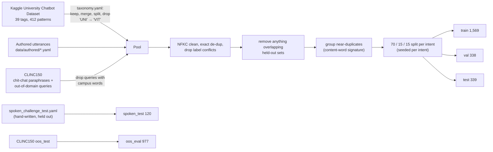
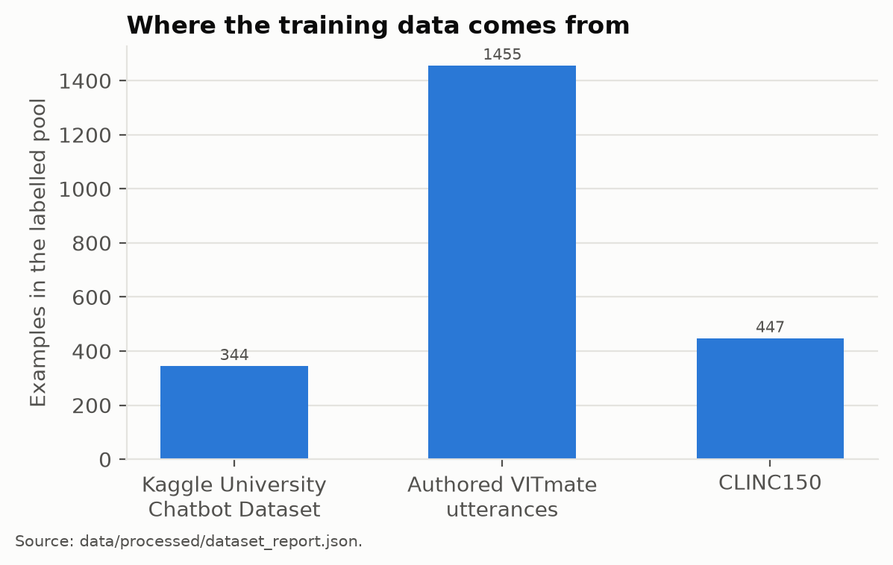
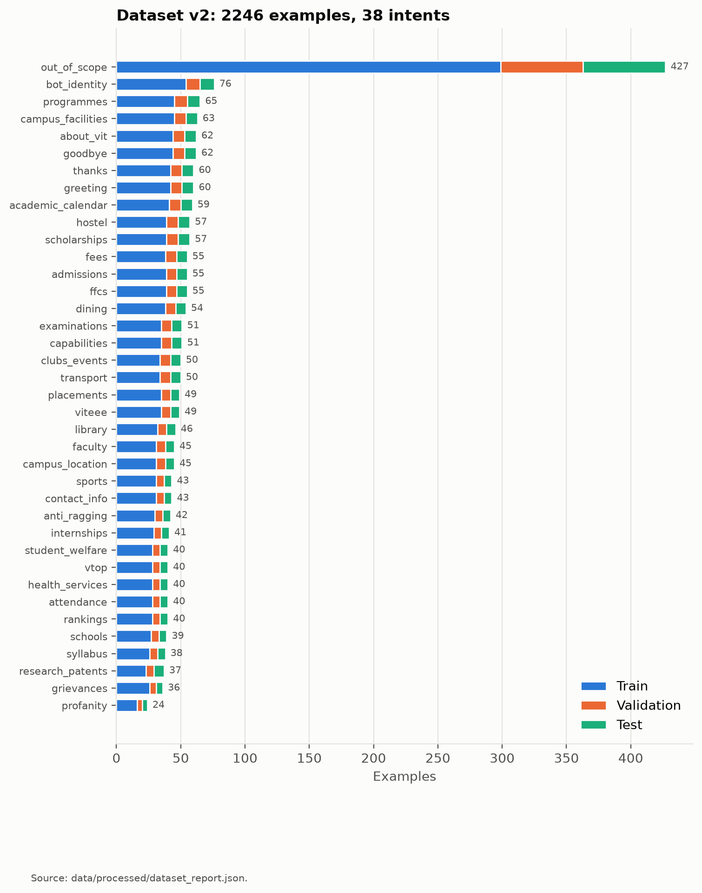

# 03 - Dataset

The VITmate dataset is **not** an untouched public dataset. An existing university chatbot dataset was used as the **foundation** and then **adapted and extended** for a VIT-specific assistant. Out-of-domain data comes from a public intent benchmark.

Build it with `python -m training.build_dataset`. The output goes to `data/processed/`, and statistics to `data/processed/dataset_report.json`.

## Sources

| Source | Licence | Use | Examples (v2 pool) |
|---|---|---|---|
| **University Chatbot Dataset**, Tushar Paul (Kaggle `tusharpaul2001/university-chatbot-dataset`; also distributed by GTS at gts.ai), `data/raw/university_chatbot_intents.json` | Apache 2.0 | Foundation: 39 intents / 412 patterns, remapped to the VITmate taxonomy | 344 |
| **Authored VITmate utterances**, `data/authored/*.yaml` | Project data | New VIT intents and diverse phrasing: short and long, formal and casual, Indian-English, and speech-like transcripts ("uh", "um", no punctuation) | 1,455 |
| **CLINC150** (Larson et al., 2019), `data/raw/clinc150_data_full.json` | CC BY 3.0 | Up to 30 paraphrases each for greeting / goodbye / thanks / bot identity / capabilities; out-of-domain queries for `out_of_scope`; a **held-out OOS test split** | 447 |

The authored utterances were written with AI assistance during development and then reviewed. **VITmate uses no external LLM at runtime.**

## Analysis of the original dataset

| Observation | Consequence |
|---|---|
| 39 intents with only 3–27 patterns each | Too small for reliable fine-tuning, so it was extended |
| Placeholder responses ("NUMBER", "LINK", "XYZ is college principal") or text about another college | **All responses discarded**; answers come from the knowledge base |
| Overlapping tags (`hod`/`ithod`/`computerhod`/`extchod`; `sem`/`vacation`/`Mess Timetable`) | Merged |
| Keyword-only or corrupted patterns ("it", "k", "??? ??? ??") | Removed through `pattern_overrides` |
| No out-of-scope examples | `out_of_scope` built from CLINC150 and authored queries |

## Taxonomy (38 intents in v2)

Defined in [`data/taxonomy.yaml`](../data/taxonomy.yaml).

| Action | Original tags → VITmate intent |
|---|---|
| **Kept** | greeting, goodbye, hostel, library, sports, placement → placements, scholarship → scholarships, syllabus |
| **Adapted** | salutaion → thanks, task → capabilities, swear → profanity, location → campus_location, number → contact_info, course → programmes, sem → examinations, vacation → academic_calendar, event + committee → clubs_events, ragging → anti_ragging, fees (hostel-fee patterns moved here) |
| **Merged** | name + creator → bot_identity, admission + document → admissions, canteen + menu → dining, facilities + infrastructure + floors → campus_facilities, the four HOD tags → faculty, principal → about_vit, random → out_of_scope |
| **Split** | `Mess Timetable` → dining / transport / academic_calendar |
| **Removed** | `hours`, `uniform` and `college intake` (no verifiable official information) |
| **New in v1** | ffcs, schools, attendance, viteee, health_services, transport, vtop, student_welfare, grievances, internships |
| **New in v2** | **rankings** (NIRF / QS / THE / NAAC) and **research_patents** (research, patents, innovation), both backed by NIRF and official VIT sources in the knowledge base |

## Cleaning and leakage prevention

1. NFKC normalisation and whitespace collapsing.
2. Exact de-duplication on a lower-cased, punctuation-free key.
3. **Label conflicts:** a text that appears under two intents is dropped entirely (none in v2).
4. **Near-duplicate grouping:** utterances sharing the same content words (ignoring fillers such as "uh", "please", "can you tell me") stay in one split.
5. **Stratified 70/15/15 split per intent**, seeded **per intent** from v2 on, so adding data to one intent never reshuffles another.
6. **Held-out protection:** 40 pool utterances overlapping the spoken challenge or OOS test sets were removed.
7. `tests/test_dataset.py` asserts that no text is shared between train and the other splits, that every intent appears in every split, and that the classes are reasonably balanced.

## Dataset versions

| Property | v1 (initial application) | v2 (this iteration) |
|---|---|---|
| Intents | 36 | **38** (+ rankings, research_patents) |
| Labelled pool | 2,119 | **2,246** |
| Train / val / test | 1,478 / 322 / 319 | **1,569 / 338 / 339** |
| Spoken-style challenge | 113 | **120** (+7 for the new intents and "is VIT a good place to study") |
| OOS evaluation | 983 | **977** (see below) |
| Split seeding | one shared RNG | seeded per intent |

**What changed in v2, and why:**

- **`data/authored/v2_additions.yaml` (133 utterances):**
  - 40 for `rankings` and 37 for `research_patents`
  - 19 broad evaluative questions for `about_vit` ("is VIT good", "should I join VIT", "what makes VIT special"). The v1 model answered these with "please rephrase".
  - targeted examples for the weakest v1 intents: `campus_facilities` (+15), `academic_calendar` (+12) and `transport` (+10)
- **Four ranking/accreditation examples moved** from `about_vit` to `rankings`.
- **Label-noise fix:** the filter that keeps campus questions out of CLINC's negatives missed plurals, so "when do classes start" had entered `out_of_scope` as a label error. Plural forms are now matched, which also removes 6 such queries from the OOS evaluation set (983 → 977).
- **Why v1 and v2 results can't be compared one-to-one:** the test set changed. It is larger, includes the new intents, and is re-split. The v1 results are archived in [`results/v1/`](results/v1/).

## Final dataset (v2)

| Intent | Train | Val | Test | Total | v1 total |
|---|---|---|---|---|---|
| `greeting` | 42 | 9 | 9 | 60 | 60 |
| `goodbye` | 44 | 9 | 9 | 62 | 62 |
| `thanks` | 42 | 9 | 9 | 60 | 60 |
| `bot_identity` | 54 | 11 | 11 | 76 | 76 |
| `capabilities` | 35 | 8 | 8 | 51 | 51 |
| `profanity` | 16 | 4 | 4 | 24 | 24 |
| `out_of_scope` | 299 | 64 | 64 | 427 | 429 |
| `about_vit` | 44 | 9 | 9 | 62 | 47 |
| `rankings` | 28 | 6 | 6 | 40 | new |
| `research_patents` | 23 | 6 | 8 | 37 | new |
| `campus_location` | 31 | 7 | 7 | 45 | 45 |
| `contact_info` | 31 | 6 | 6 | 43 | 43 |
| `ffcs` | 39 | 8 | 8 | 55 | 55 |
| `programmes` | 45 | 10 | 10 | 65 | 65 |
| `schools` | 27 | 6 | 6 | 39 | 39 |
| `faculty` | 31 | 7 | 7 | 45 | 45 |
| `syllabus` | 26 | 6 | 6 | 38 | 38 |
| `examinations` | 35 | 8 | 8 | 51 | 51 |
| `academic_calendar` | 41 | 9 | 9 | 59 | 47 |
| `attendance` | 28 | 6 | 6 | 40 | 40 |
| `admissions` | 39 | 8 | 8 | 55 | 55 |
| `viteee` | 35 | 7 | 7 | 49 | 49 |
| `fees` | 38 | 9 | 8 | 55 | 55 |
| `scholarships` | 39 | 9 | 9 | 57 | 57 |
| `hostel` | 39 | 9 | 9 | 57 | 57 |
| `dining` | 38 | 8 | 8 | 54 | 54 |
| `library` | 32 | 7 | 7 | 46 | 46 |
| `sports` | 31 | 6 | 6 | 43 | 43 |
| `health_services` | 28 | 6 | 6 | 40 | 40 |
| `transport` | 34 | 8 | 8 | 50 | 40 |
| `campus_facilities` | 45 | 9 | 9 | 63 | 48 |
| `clubs_events` | 34 | 8 | 8 | 50 | 50 |
| `vtop` | 28 | 6 | 6 | 40 | 40 |
| `student_welfare` | 28 | 6 | 6 | 40 | 40 |
| `anti_ragging` | 30 | 6 | 6 | 42 | 42 |
| `grievances` | 26 | 5 | 5 | 36 | 36 |
| `placements` | 35 | 7 | 7 | 49 | 49 |
| `internships` | 29 | 6 | 6 | 41 | 41 |

**Class balance:** VIT intents have 36–76 examples each. `out_of_scope` (427) is intentionally larger because it must cover an open-ended space of unrelated questions, and training uses inverse-√frequency class weights.

## Robustness iteration (v1)

After the first v1 models were trained, probing with edge cases showed confident misclassifications:

- keyboard gibberish ("asdf") → `examinations`
- other universities ("tell me about IIT Madras") → `about_vit`
- branch-change questions → `syllabus`

`data/authored/robustness.yaml` (53 utterances) was added, and all v1 candidates were retrained and re-compared. The held-out sets were not changed. See [04-model-development.md](04-model-development.md).
