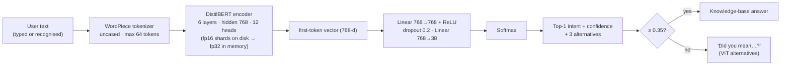

# 04 · Model Development

This document records **how the deployed model was actually arrived at**: what was tried, in what order, what was discarded and why. Numbers come from the files in [`results/`](results/) and [`results/v1/`](results/v1/).

## Requirements that shaped the choice

- The assignment requires a **deep-learning** intent classifier; keyword rules or an LLM API don't qualify.
- **CPU-only** inference, suitable for a free hosting tier (≈1 GB RAM).
- A small dataset (about 1,500–1,600 training examples, 36–38 classes), so a **pretrained** encoder fine-tuned for classification is the natural fit.
- Selection by measured **validation macro-F1**, not by model popularity or size.

## Final inference pipeline

The model is loaded **once** at API startup (`IntentClassifier`, `backend/app/ml/intent_classifier.py`) and runs under `torch.inference_mode()`. The same class is used by `training/evaluate.py`, so the reported metrics come from exactly the code that serves users.

## Timeline of experiments

### Stage 1 — first comparison (pre-robustness data, discarded)

A first comparison ran on an early version of dataset v1 (before the robustness batch). **The dataset then changed**, so those runs were discarded and every candidate was retrained. Their numbers weren't archived, and they aren't used anywhere in the results.

### Stage 2 — probing revealed data gaps

Probing a trained candidate through the running API found **confident misclassifications**. These values were recorded from the API responses during that probe; they aren't part of an archived result file.

| Input | Predicted | Confidence |
|---|---|---|
| "asdf" | examinations | 0.82 |
| "lorem ipsum dolor" | dining | 0.89 |
| "tell me about IIT Madras" | about_vit | 0.91 |
| "how to change my branch" | syllabus | 0.67 |

Fine-tuned transformers are over-confident on inputs unlike anything in training. The fix was **data, not a bigger model**: `data/authored/robustness.yaml` added gibberish, other universities and branch-change questions (53 utterances).

### Stage 3 — v1 comparison and selection (archived in `results/v1/`)

All five candidates were retrained on the same splits (dataset v1: 36 intents, 1,478 / 322 / 319). The two best by validation macro-F1 were re-run with seeds 7 and 13:

| Candidate | Seeds | Params (M) | Val macro-F1 | Test macro-F1 | Spoken macro-F1 | Latency (ms) |
|---|---|---|---|---|---|---|
| TF-IDF + LogReg | 1 | – | 0.8022 | 0.8178 | 0.9274 | 1.08 |
| BERT-mini | 1 | 11.2 | 0.8311 | 0.8288 | 0.9571 | 2.0 |
| MiniLM-L6 | 3 | 22.7 | 0.8741 ± 0.0058 | 0.8820 ± 0.0029 | 0.9557 ± 0.0014 | 4.23 |
| **bge-small** | 3 | 33.4 | **0.8943 ± 0.0098** | 0.8661 ± 0.0187 | **0.9655 ± 0.0098** | 7.76 |
| DistilBERT | 1 | 67.0 | 0.8790 | 0.8654 | 0.9584 | 12.75 |

**Decision:** bge-small, by the pre-set rule (mean validation macro-F1). MiniLM-L6 was slightly higher on the **test** set, but that gap is within bge-small's seed variance, and choosing by test score would leak the test set into model selection. The v1 deployed model achieved:

- test accuracy **0.8589**, macro-F1 **0.8490**, weighted-F1 **0.8573** (n = 319)
- spoken-style accuracy **0.9558**, macro-F1 **0.9552** (n = 113)
- out-of-scope recall **89.93%** on 983 held-out CLINC150 queries (threshold 0.35)
- median latency **8.02 ms** on CPU; process RSS **683.6 MB**

### Stage 4 — threshold: placeholder rejected

The backend initially used a guessed threshold of **0.5**. The validation sweep showed this model's softmax confidences rarely exceed about 0.85, so 0.5 would have **rejected 11.2% of valid validation questions**. The measured best, **0.35**, maximised validation macro-F1 while rejecting 2.7%. It became the default.

### Stage 5 — dataset v2 and re-comparison

Dataset v2 added the `rankings` and `research_patents` intents, broad "is VIT good?" questions and targeted weak-intent examples (see [03-dataset.md](03-dataset.md)). Because the data changed, **the whole comparison was re-run** instead of assuming bge-small was still best.

1. **All five candidates at seed 42, then the top two by validation macro-F1 with seeds 7 and 13.** The top two were **DistilBERT (0.8951 ± 0.0061)** and **bge-small (0.8876 ± 0.0061)**. BERT-mini (0.8698) overtook MiniLM-L6 (0.8495) this time.
2. **The threshold sweep chose 0.0 for both finalists.** On v2, abstaining never improves validation macro-F1 by a measurable amount, but a threshold of 0 would disable the low-confidence safety net and the new "did you mean" suggestions. After review with the developer, the deployed threshold stays at **0.35 as a safety floor**, and the sweep optimum is reported alongside it.
3. **A fair finalist comparison at the deployed threshold** (`training/final_comparison.py`, all six seed checkpoints, memory measured in fresh processes) used a rule fixed before it ran:
   - primary: validation macro-F1 at 0.35
   - if the gap is within noise, validation guardrails (OOS recall, in-scope rejection) decide, then latency and resources
4. **Result:**
   - The primary gap of 0.0042 was smaller than the seed SD (0.0092), so it counted as noise.
   - The validation OOS-recall guardrail favoured DistilBERT (0.927 vs 0.901), with in-scope rejection tied.
   - **DistilBERT was selected.**
   - bge-small's better test score (0.883 vs 0.868 at 0.35) was **not** used, because that would leak the test set.
5. **Final training** (`python -m training.train`, DistilBERT, seed 42) reproduced the comparison run exactly (best epoch 5, validation macro-F1 0.8895). The fp16 weights were saved as two shards under 90 MB each.

The deployed v2 model achieved:

- test accuracy **0.8496**, macro-F1 **0.8496**, weighted-F1 **0.8499** (n = 339, arg-max)
- spoken-style accuracy **0.9500**, macro-F1 **0.9533** (n = 120)
- out-of-scope recall **90.58%** on 977 held-out queries (threshold 0.35)
- median latency **12.78 ms** on CPU; 683 MB RSS in a fresh process

Full details are in [05-model-comparison.md](05-model-comparison.md) and [07-evaluation.md](07-evaluation.md).

## What was tried and discarded

| Approach | Outcome | Why discarded |
|---|---|---|
| Keyword / regex matching | Not built as the classifier | Doesn't satisfy the deep-learning requirement; brittle for paraphrases |
| External LLM API (generation) | Not used | Hallucination risk, external dependency and cost; doesn't satisfy "trained deep-learning model" |
| TF-IDF + logistic regression | Kept **only as a baseline** | 0.80 validation macro-F1: every transformer was better |
| BERT-mini (11M) | Trained and compared (v1, v2) | Fastest, but lower validation macro-F1 than the finalists |
| bge-small (33M) | **Deployed in v1**; v2 finalist | Tied with DistilBERT on v2 validation (within noise) but lower validation OOS recall. Faster and smaller; better on the v2 test set (reported only) |
| MiniLM-L6 (23M) | v1 finalist | Lower mean validation macro-F1 than bge-small in v1, and lower than BERT-mini in v2 |
| First comparison run | Discarded | The dataset changed after robustness probing |
| Threshold 0.5 | Replaced by 0.35 | Would reject 11% of valid questions |
| Single-file fp32 checkpoint | Replaced by fp16, sharded under 90 MB | Exceeds GitHub's 100 MB file limit; fp16 storage doesn't change fp32 inference |
| Threshold from the v2 sweep (0.0) | Replaced by a 0.35 safety floor | 0.0 would disable the low-confidence fallback; the measured cost of 0.35 is 0.0047 validation macro-F1 |
| Choosing the model by test score | Explicitly avoided | It would leak the test set into model selection |
| Server-side speech recognition (Whisper) | Not built | Heavy CPU/RAM, uploads audio; browser recognition meets the requirement |
| Response streaming | Not built | Answers are retrieved, not generated, and complete in milliseconds, so streaming would be cosmetic |

## Where the results live

- Model comparison: [`results/model_comparison.md`](results/model_comparison.md) (v2) · [`results/v1/model_comparison.md`](results/v1/model_comparison.md)
- Final evaluation: [`results/evaluation.md`](results/evaluation.md) (v2) · [`results/v1/evaluation.md`](results/v1/evaluation.md)
- Training history: `backend/trained_model/training_summary.json` · [`results/v1/training_summary.json`](results/v1/training_summary.json)
- Graphs: [`graphs/`](graphs/) (see [05](05-model-comparison.md) and [07](07-evaluation.md))
