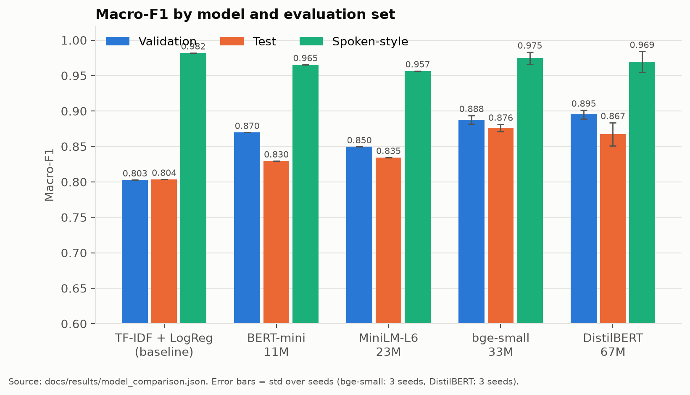
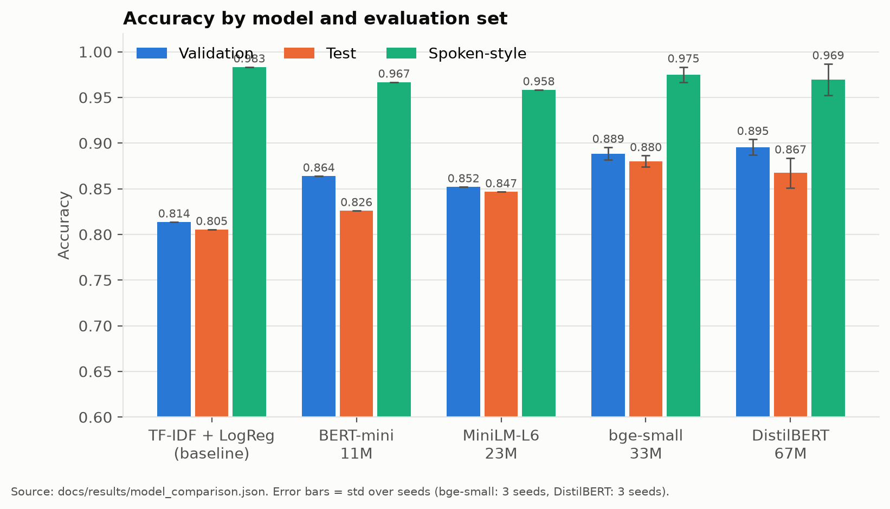
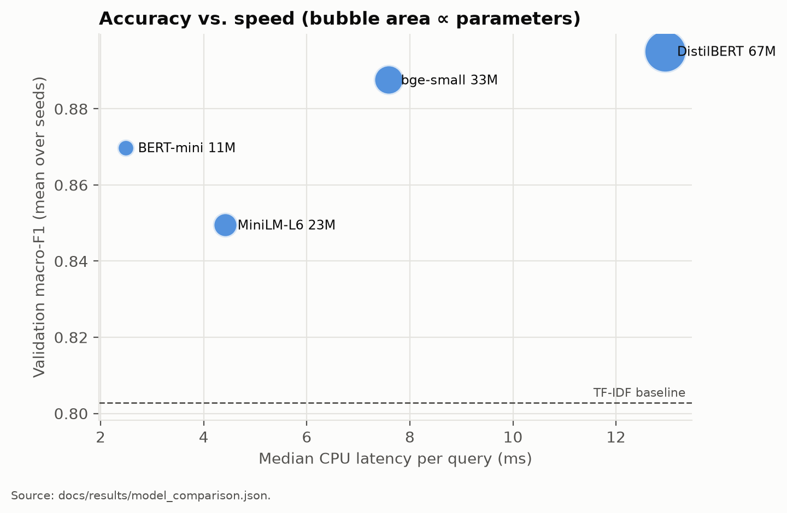
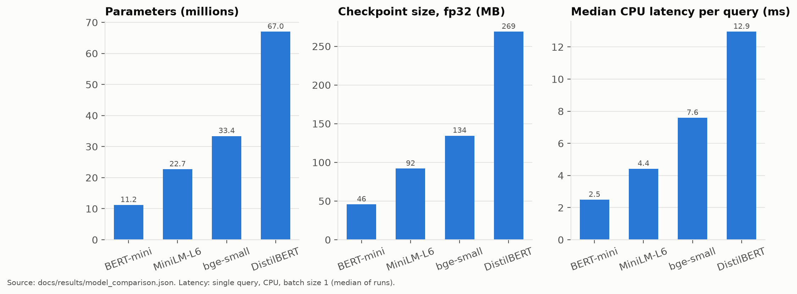
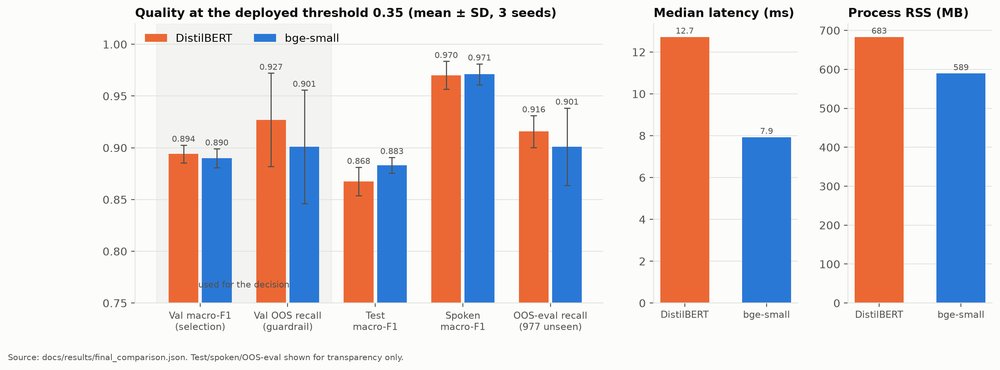

# 05 - Model Comparison

Every candidate was trained and evaluated on **the same splits with the same code** (`training/train.py`, `training/compare_models.py`). **Model selection uses validation data only.** The test, spoken-style and OOS sets are reported for transparency and never drive a decision.

Raw results:

- [`results/model_comparison.json`](results/model_comparison.json) / [`.md`](results/model_comparison.md): all candidates, dataset v2
- [`results/final_comparison.json`](results/final_comparison.json) / [`.md`](results/final_comparison.md): the finalists head-to-head
- [`results/v1/model_comparison.md`](results/v1/model_comparison.md): dataset v1

## Candidates

| Candidate | Hugging Face id | Type | Parameters | Learning rate |
|---|---|---|---|---|
| Baseline | TF-IDF (word 1–2 + char 2–5-grams) + logistic regression | classical ML | – | – |
| BERT-mini | `google/bert_uncased_L-4_H-256_A-4` | 4-layer BERT | 11.2M | 2e-4 |
| MiniLM-L6 | `sentence-transformers/all-MiniLM-L6-v2` | 6-layer MiniLM | 22.7M | 1e-4 |
| bge-small | `BAAI/bge-small-en-v1.5` | 12-layer BERT (small) | 33.4M | 1e-4 |
| DistilBERT | `distilbert-base-uncased` | 6-layer distilled BERT | 67.0M | 5e-5 |

## Step 1 — all candidates (dataset v2, seed 42; top two with seeds 7 and 13)

| Candidate | Seeds | Val macro-F1 | Test accuracy | Test macro-F1 | Test weighted-F1 | Spoken accuracy | Spoken macro-F1 | Latency (ms) | Train (s) |
|---|---|---|---|---|---|---|---|---|---|
| TF-IDF + LogReg | 1 | 0.8028 | 0.8053 | 0.8036 | 0.8058 | 0.9833 | 0.9820 | 1.05 | 5 |
| BERT-mini | 1 | 0.8698 | 0.8260 | 0.8295 | 0.8256 | 0.9667 | 0.9654 | 2.49 | 166 |
| MiniLM-L6 | 1 | 0.8495 | 0.8466 | 0.8345 | 0.8449 | 0.9583 | 0.9566 | 4.42 | 144 |
| bge-small | 3 | 0.8876 ± 0.0061 | 0.8801 ± 0.0061 | 0.8761 ± 0.0052 | 0.8792 ± 0.0065 | 0.9750 ± 0.0083 | 0.9745 ± 0.0086 | 7.59 | 300 |
| **DistilBERT** | 3 | **0.8951 ± 0.0061** | 0.8673 ± 0.0164 | 0.8672 ± 0.0164 | 0.8675 ± 0.0163 | 0.9694 ± 0.0173 | 0.9694 ± 0.0147 | 12.95 | 593 |

*Arg-max predictions (no threshold). Latency is the median single-query CPU time.*

**Observations:**

- Every transformer beats the TF-IDF baseline on validation, by 4.7 to 9.2 points.
- The baseline's high spoken-style score (0.98) reflects how close that small set's vocabulary is to the training data. On validation and test it is the weakest model, and it has no understanding of paraphrase beyond shared n-grams.
- BERT-mini overtook MiniLM-L6 on v2 validation data, while v1 had the opposite order. Small differences between small models swap with the data.

## Step 2 — fair finalist comparison at the deployed threshold

The top two by validation macro-F1 were DistilBERT and bge-small. Their gap at arg-max (0.0075) was small, and the validation threshold sweep chose **0.0** for both, which would switch off the low-confidence safety net. So a dedicated comparison (`python -m training.final_comparison`) evaluated all six seed checkpoints **at VITmate's deployed threshold (0.35)**, the operating point users actually experience. It also measured memory in a fresh process per checkpoint.

**Decision rule, fixed before the comparison was run:**

1. Primary: mean validation macro-F1 at the deployed threshold.
2. Guardrails (validation): out-of-scope recall and in-scope rejection at the threshold.
3. If the primary gap is smaller than the larger seed SD, it is treated as noise, and the guardrails decide, then latency and resources.

| Metric (mean ± SD over seeds 42, 7, 13) | DistilBERT | bge-small |
|---|---|---|
| **Validation macro-F1 @0.35 (primary)** | **0.8941 ± 0.0086** | 0.8899 ± 0.0092 |
| Validation macro-F1 (arg-max) | 0.8951 ± 0.0061 | 0.8876 ± 0.0061 |
| **Validation OOS recall @0.35 (guardrail)** | **0.9271 ± 0.0451** | 0.9010 ± 0.0548 |
| Validation in-scope rejection @0.35 (guardrail) | 0.0194 ± 0.0201 | 0.0194 ± 0.0214 |
| Test macro-F1 @0.35 *(reported only)* | 0.8675 ± 0.0138 | 0.8831 ± 0.0077 |
| Test accuracy @0.35 *(reported only)* | 0.8633 ± 0.0201 | 0.8810 ± 0.0085 |
| Spoken macro-F1 @0.35 *(reported only)* | 0.9701 ± 0.0135 | 0.9711 ± 0.0101 |
| OOS-eval recall @0.35, 977 unseen *(reported only)* | 0.9157 ± 0.0154 | 0.9010 ± 0.0375 |
| Median / p95 latency (ms) | 12.72 / 14.63 | 7.93 / 9.21 |
| Process RSS after load and inference (MB) | 683.3 | 589.4 |
| Parameters / deployed fp16 checkpoint | 67.0M / 134 MB (2 shards) | 33.4M / 67 MB |

**Outcome:** the primary gap (0.0042) is smaller than the larger seed SD (0.0092), so it is noise. The guardrails then decided: validation OOS recall favours DistilBERT (0.927 vs 0.901), and in-scope rejection is tied. **DistilBERT was selected.**

**Caveats, stated openly:**

- The validation OOS guardrail rests on 64 validation OOS examples, so its gap is also small. It **agrees in direction** with the much larger held-out OOS-eval set (977 queries: 0.916 vs 0.901), which wasn't used for the decision.
- bge-small scored higher on the **test** set (0.883 vs 0.868 at 0.35). Using that to choose would leak the test set into model selection, so it wasn't used.
- DistilBERT costs about 5 ms more per query and about 94 MB more RAM. Both are negligible next to the 450 ms thinking animation and a 1 GB host.
- The fp16 DistilBERT checkpoint is saved as **two safetensors shards (85 MB + 48 MB)** to stay under GitHub's 100 MB per-file limit.

## Dataset v1 comparison (history)

On dataset v1 (36 intents), the same procedure selected **bge-small**:

| Candidate | Seeds | Val macro-F1 | Test macro-F1 | Spoken macro-F1 | Latency (ms) |
|---|---|---|---|---|---|
| TF-IDF + LogReg | 1 | 0.8022 | 0.8178 | 0.9274 | 1.08 |
| BERT-mini | 1 | 0.8311 | 0.8288 | 0.9571 | 2.0 |
| MiniLM-L6 | 3 | 0.8741 ± 0.0058 | 0.8820 ± 0.0029 | 0.9557 ± 0.0014 | 4.23 |
| **bge-small** | 3 | **0.8943 ± 0.0098** | 0.8661 ± 0.0187 | 0.9655 ± 0.0098 | 7.76 |
| DistilBERT | 1 | 0.8790 | 0.8654 | 0.9584 | 12.75 |

**Why the choice changed:** on v1, bge-small led DistilBERT by 1.5 points on validation. On v2, with two new intents, a larger and re-split validation set, and the robustness and weak-intent data, the finalists are within noise of each other, and the reliability guardrail tipped the balance. The results differ between datasets, so reporting both is part of the honest record.
