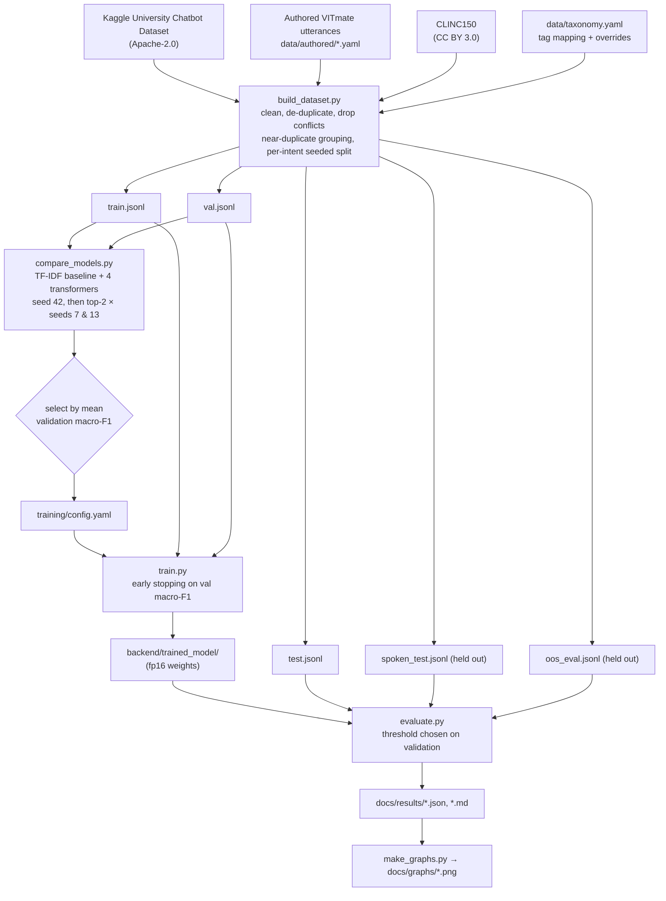
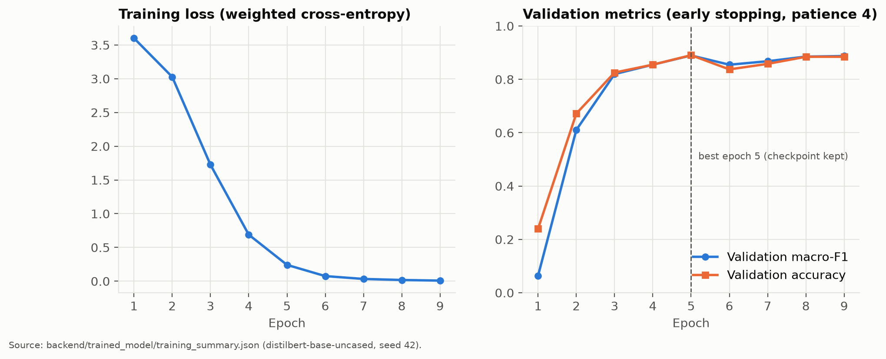

# 06 - Training Methodology

Code: `training/train.py` (fine-tuning), `training/config.yaml` (deployed hyperparameters), `training/compare_models.py` (candidates), `training/common.py` (data loading and metrics).

## Pipeline

The test, spoken-style and OOS sets are **never** used for any decision: not model selection, not early stopping, not the threshold.

## Fine-tuning set-up

| Item | Value |
|---|---|
| Base model | `distilbert-base-uncased`: 6 Transformer layers, hidden size 768, 12 attention heads, FFN 3072, 67.0M parameters (v1 used `BAAI/bge-small-en-v1.5`) |
| Head | `DistilBertForSequenceClassification`: first-token vector → Linear 768→768 + ReLU → dropout 0.2 → Linear 768→38 |
| Tokenizer | WordPiece (uncased, 30,522 vocab), max length 64, dynamic padding |
| Loss | Cross-entropy with **inverse-√frequency class weights**, normalised to mean 1 |
| Optimizer | AdamW, learning rate 5e-5 (DistilBERT; 1e-4 for bge-small in v1), weight decay 0.01 |
| Schedule | Linear decay with 10% warm-up |
| Batch size | 16 |
| Epochs | up to 25, with **early stopping** on validation macro-F1 (patience 4) |
| Checkpointing | the best-epoch weights are restored and saved; stored as fp16 and loaded in fp32 |
| Gradient clipping | 1.0 |
| Seed | 42 (and 7 and 13 in the comparison) |
| Hardware | CPU only (16-thread laptop CPU) |

Learning rates per candidate:

| Candidate | Learning rate |
|---|---|
| BERT-mini | 2e-4 |
| MiniLM-L6 | 1e-4 |
| bge-small | 1e-4 |
| DistilBERT | 5e-5 |

These are standard values for models of each size and were not tuned on the test set.

## Why these choices

- **Class weights:** the `out_of_scope` class is deliberately large because it covers an open-ended space of unrelated questions. √-weighting stops it from dominating without over-boosting tiny classes.
- **Macro-F1 for early stopping and selection:** every intent counts equally, so small intents such as `grievances` or `profanity` matter.
- **Early stopping:** with about 1,600 training examples, a transformer can overfit within a few epochs. Stopping on validation macro-F1 keeps the best generalising checkpoint.
- **fp16 storage and sharding:** fp16 halves the checkpoint (DistilBERT 268 MB → 134 MB). It is saved as two safetensors shards (85 MB + 48 MB), each under GitHub's 100 MB file limit. Weights are upcast to fp32 at load time, and the reported evaluation runs on exactly these weights.
- **Multiple seeds:** single-seed differences of 1–2 macro-F1 points on about 330 validation examples are within noise, so the top two candidates are compared on the mean of three seeds.

## Training curve of the deployed model

*Loss and validation metrics per epoch. The dashed line marks the restored best epoch. Source: `backend/trained_model/training_summary.json`.*

## Confidence threshold

After training, `evaluate.py` sweeps thresholds from 0.00 to 0.95 **on the validation set**, treating predictions below the threshold as "not answered". The threshold with the best validation macro-F1 becomes the deployed `VITMATE_CONFIDENCE_THRESHOLD`. See [07-evaluation.md](07-evaluation.md) for the sweep.

## Reproducibility

- Fixed seeds, and the split is seeded per intent, so adding data to one intent never reshuffles another.
- `training_summary.json` stores the configuration, per-epoch history, best epoch, training time and parameter count.
- `python -m training.train` reproduces the deployed model. The seed-42 run in the comparison produces the same best validation macro-F1 as the final training run.
