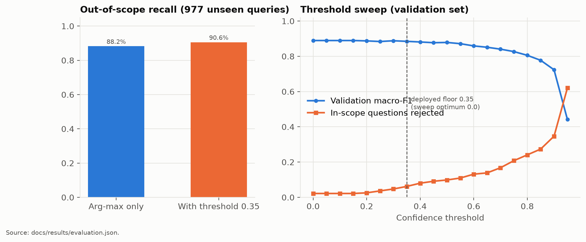
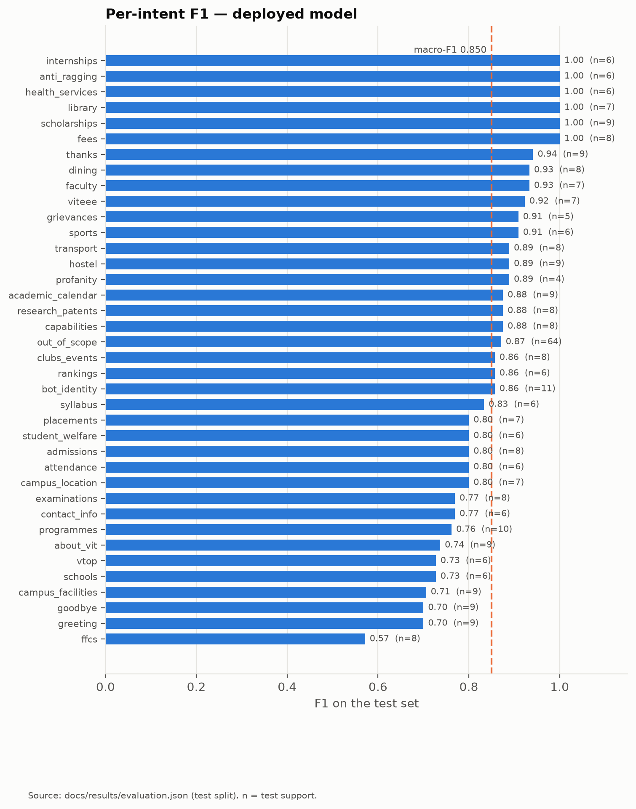
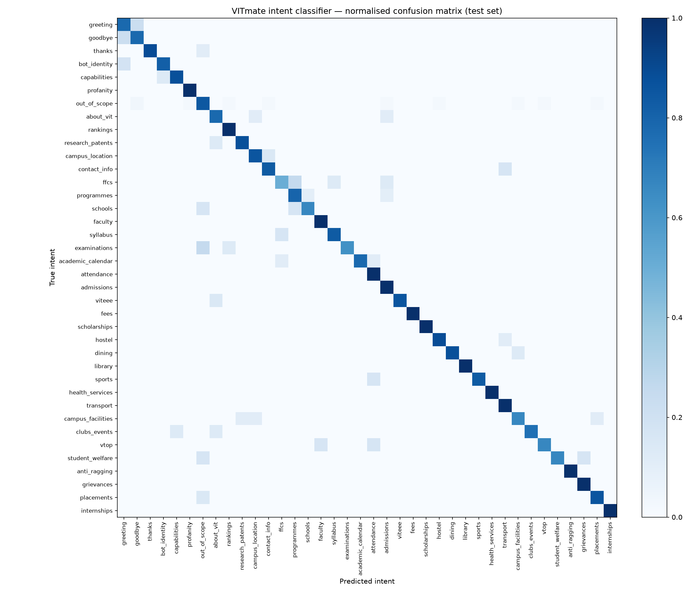
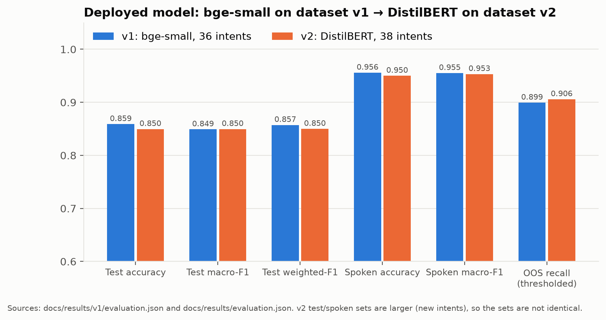

# 07 · Evaluation

Deployed model: **DistilBERT** (`distilbert-base-uncased`, 67.0M parameters, 38 intents), dataset v2, seed 42. It was produced by `python -m training.train` and evaluated with `python -m training.evaluate`. Full output, including every misclassified test example: [`results/evaluation.md`](results/evaluation.md) · [`results/evaluation.json`](results/evaluation.json) · [`results/per_intent_metrics.csv`](results/per_intent_metrics.csv).

## Metrics used

| Metric | Definition | Why it matters here |
|---|---|---|
| Accuracy | correct / total | Overall hit rate |
| Precision, recall, F1 (per intent) | P = TP/(TP+FP), R = TP/(TP+FN), F1 = 2PR/(P+R) | Shows which topics are confused |
| **Macro-F1** | unweighted mean of per-intent F1 | Every intent counts equally; **primary selection metric** |
| Weighted-F1 | per-intent F1 weighted by support | Reflects the class mix |
| Confusion matrix | true × predicted counts (normalised per row) | Which intents are mistaken for which |
| **Out-of-scope recall** | share of unrelated queries answered as out of scope (or below the threshold) | Protects against answering non-VIT questions |
| In-scope not answered | share of VIT questions predicted `out_of_scope` or below the threshold | The cost of the threshold |
| Latency, memory | median / p95 single-query CPU time; process RSS | Deployment feasibility |

## Evaluation sets

| Set | Size | Built from | Used for decisions? |
|---|---|---|---|
| Validation | 338 | 15% stratified split | **Yes:** early stopping, model selection, threshold sweep |
| Test | 339 | 15% stratified split | No, reported only |
| Spoken-style challenge | 120 | hand-written transcripts with fillers and no punctuation (`spoken_challenge_test.yaml`) | No |
| OOS evaluation | 977 | CLINC150 `oos_test` (minus campus-word queries) | No |

## Results of the deployed model

| Set | Accuracy | Macro P | Macro R | **Macro F1** | Weighted F1 |
|---|---|---|---|---|---|
| Test, arg-max (n = 339) | 0.8496 | 0.8578 | 0.8576 | **0.8496** | 0.8499 |
| Test, threshold 0.35 | 0.8407 | 0.8746 | 0.8437 | 0.8521 | 0.8407 |
| Spoken-style, arg-max (n = 120) | 0.9500 | 0.9605 | 0.9572 | **0.9533** | 0.9496 |
| Spoken-style, threshold 0.35 | 0.9500 | 0.9638 | 0.9572 | 0.9555 | 0.9493 |

- **Out-of-scope recall** on 977 unseen queries: **90.58%** with the threshold (88.23% arg-max only).
- **In-scope test questions not answered with an intent** (predicted out-of-scope or below 0.35): 6.18%. These get "did you mean…?" suggestions rather than a wrong answer.
- **Latency (CPU, one query at a time):** median **12.78 ms**, mean 12.96 ms, p95 15.40 ms. Model load time 0.14 s (warm file cache).
- **Memory:** 683 MB RSS for a fresh process that loads the model and runs inference (the average of 3 seeds, measured by `final_comparison.py`). 829 MB inside the evaluation script, which also loads datasets, scikit-learn and matplotlib.
- **Size:** 134.9 MB on disk (fp16, two shards).

The multi-seed view (mean ± SD) of the same model family is in [05-model-comparison.md](05-model-comparison.md). The single deployed seed-42 checkpoint sits below the 3-seed test mean (0.8496 vs 0.8672), which shows how much variation a single training run carries on a test set of 339 examples.

## Confidence threshold

The validation sweep for this model peaks at **0.0** (validation macro-F1 0.8895). Abstaining never improves macro-F1 by a measurable amount, because the `out_of_scope` class already absorbs most unrelated questions. A threshold of 0.0 would, however, switch off VITmate's low-confidence safety net and its "did you mean" suggestions. The deployed threshold is therefore kept at **0.35 as a documented safety floor**. On validation it costs 0.0047 macro-F1 (0.8848 vs 0.8895), and it raises OOS recall on the 977 unseen queries from 88.2% to 90.6%.

History: in v1 the same sweep picked 0.35 (bge-small, validation macro-F1 0.9008). The initial placeholder of 0.5 would have rejected 11% of valid questions.

## Per-intent performance

**Strongest:** internships, anti-ragging, health services, library, scholarships and fees (F1 1.00 on test).

**Weakest:**

| Intent | Test F1 (n) | What goes wrong |
|---|---|---|
| `ffcs` | 0.571 (8) | Edge questions overlap other intents: "what is a minor degree" → programmes, "can I switch branches after first year" → programmes, "how many credits do I need to graduate" → admissions. Core questions ("What is FFCS?") are classified correctly (0.92). |
| `greeting`, `goodbye` | 0.70 (9 each) | Short chit-chat is confused between the two and with thanks ("nice to see you again") |
| `campus_facilities` | 0.706 (9) | A broad topic that overlaps dining, transport and clubs |
| `schools`, `vtop` | 0.727 (6 each) | Short acronym-style queries ("what is SENSE", "v top portal") |

Per-intent F1 on 5–10 test examples moves by 0.1–0.2 with a single example, so these values are indicative.

### Targeted v1 weak intents

The v2 dataset added examples for the three weakest v1 intents:

| Intent | v1 (bge-small) | v2 (DistilBERT) |
|---|---|---|
| `campus_facilities` | 0.364 | 0.706 |
| `academic_calendar` | 0.615 | 0.875 |
| `transport` | 0.667 | 0.889 |

The model and the test split also changed, so this is **indicative, not a controlled comparison**.

## Before and after (deployed models)

| | v1: bge-small, 36 intents | v2: DistilBERT, 38 intents |
|---|---|---|
| Test (n) | 319 | 339 |
| Test accuracy / macro-F1 / weighted-F1 | 0.8589 / 0.8490 / 0.8573 | 0.8496 / 0.8496 / 0.8499 |
| Spoken-style (n) accuracy / macro-F1 | (113) 0.9558 / 0.9552 | (120) 0.9500 / 0.9533 |
| OOS recall with threshold (n) | 89.93% (983) | 90.58% (977) |
| Median latency | 8.02 ms | 12.78 ms |
| Memory (evaluation process) | 683.6 MB | 829.0 MB |

The two columns use **different test sets** (v2 is re-split and includes the two new intents), so this is a record of the deployed systems, not a like-for-like model comparison. The like-for-like comparison is in [05](05-model-comparison.md).

## Beyond the metrics: behaviour checks on the live system

Checked against the running API and in headless Chrome:

| Query | v1 behaviour | v2 behaviour |
|---|---|---|
| "is VIT good" | low confidence → "please rephrase" | `about_vit` (0.96), a factual overview with NIRF 2025 rank, NAAC A++ and campuses, then an invitation to ask about specific areas |
| "how many patents does VIT have" | `scholarships` (low confidence) | `research_patents` (0.92): NIRF-submission figures with years, plus the IPR Cell discrepancy |
| "How is VIT ranked?" | not a supported intent | `rankings` (0.95): NIRF 2025, THE 2026, QS (as reported by VIT), NAAC |
| "what is the dress code at VIT" | low confidence (0.27) → "please rephrase" | below the threshold (0.21) → three "did you mean" suggestions to pick from |
| "asdfgh qwerty" | `out_of_scope` | `out_of_scope` (0.90) |
| "tell me about IIT Madras" | `out_of_scope` | `out_of_scope` (0.73) |
| "what are the college timings" | clubs_events (low confidence) | `sports` (0.54). **Still a miss:** college timings aren't a supported topic, because no official timings are published |
