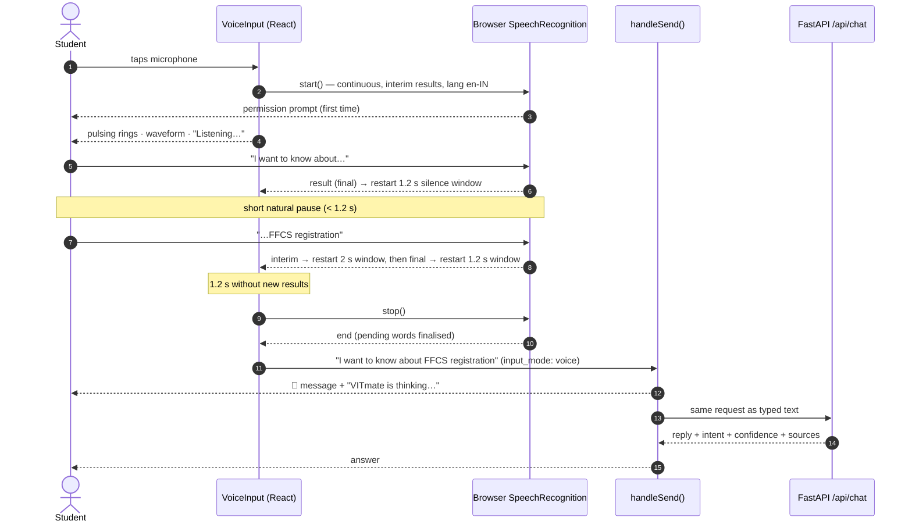
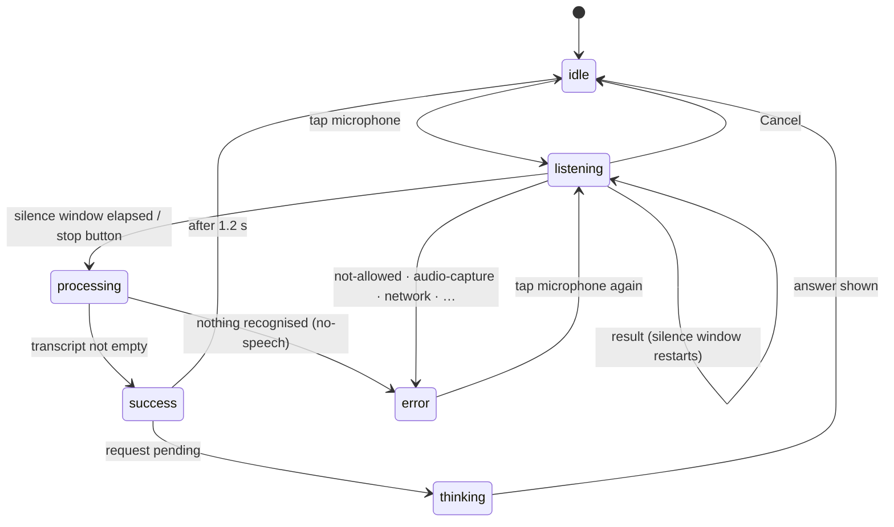

# 08 · Speech Recognition

VITmate uses **browser-native speech recognition** through the **Web Speech API** (`SpeechRecognition`, or `webkitSpeechRecognition` in some Chromium builds). Users don't need to install anything. They open the site, switch to **Speak**, allow the microphone and talk.

Code: `frontend/src/hooks/useSpeechRecognition.ts` (behaviour), `frontend/src/services/speechSupport.ts` (feature detection), `frontend/src/components/VoiceInput.tsx` (UI), `frontend/src/components/SpeechSupportBanner.tsx` (compatibility notice).

## Voice interaction

The transcript enters **the same `handleSend()` as typed text**. There is no separate voice chatbot.

**Privacy note.** VITmate's server receives only the recognised text, never audio. In Chrome and Edge the browser sends audio to the vendor's cloud speech service to perform recognition, so an internet connection is needed and the vendor's privacy policy applies.

## Pause handling (improved in this version)

**Before:** recognition ran with `continuous = false`. Chrome ends such a session at the first pause it detects (often about half a second), and VITmate submitted immediately. Saying "I want to know about … FFCS registration" sent only "I want to know about".

**Now:**

| Setting / rule | Value | Why |
|---|---|---|
| `continuous` | `true` | The browser keeps listening through pauses; VITmate decides when the question is finished |
| Silence window after a **final** phrase | `FINAL_PAUSE_MS = 1200` | Tolerates natural pauses between phrases, but the answer still follows about 1.2 s after the user stops |
| Silence window while the browser holds an **unfinished (interim)** phrase | `INTERIM_PAUSE_MS = 2000` | Words still being recognised get a little longer before submission |
| Window reset | on every `result` event | Any new speech restarts the countdown |
| Stop button | submits immediately | The user can skip the wait |
| Safety limit | `MAX_LISTEN_MS = 30000` | A stuck session always ends |
| Segment merging | `mergeSegments()` | Some mobile Chrome builds repeat the cumulative transcript in every segment; those are replaced rather than appended |

There is no artificial delay beyond the silence window. The timing is covered by fake-timer tests in `frontend/src/test/speech.test.tsx`:

- a pause shorter than the window doesn't submit
- speech after the pause is appended
- submission happens once the window elapses
- interim text waits longer
- the stop button submits immediately

## States

| State | UI |
|---|---|
| `idle` | Blue microphone, "Tap the microphone and ask your question" |
| `listening` | Red stop button, pulsing rings, animated waveform, live transcript, Cancel link |
| `processing` | Spinner while the browser finalises |
| `success` | Green check and "Got it!" |
| thinking (request pending) | Spinner and "VITmate is thinking…"; the chat thread shows the thinking indicator too |
| `error` | Red message explaining how to fix it; tapping the microphone retries |

## Error handling

| Situation | Detection | Message shown |
|---|---|---|
| Browser without the API (e.g. Firefox) | no `SpeechRecognition` constructor | Compatibility banner at the top; the Speak panel explains and offers *Learn more* and *Switch to Type* |
| Page not on HTTPS/localhost | `window.isSecureContext === false` | "Voice input needs a secure connection." |
| Microphone permission denied | `not-allowed` / `service-not-allowed` | How to re-enable the microphone from the address bar |
| No microphone | `audio-capture` | "No microphone was found…" |
| Silence / nothing recognised | `no-speech`, or an empty transcript | "I didn't catch anything…" (nothing is sent) |
| Speech service unreachable | `network` | Check the internet connection |
| Unsupported language | `language-not-supported` | Explanation |
| Cancel | `abort()` with handlers detached | Returns to idle silently |
| Repeated taps | guard in `start()` | Only one session runs at a time |

## Browser-compatibility banner and "Learn more"

When feature detection finds no usable speech recognition, a dismissible banner appears under the header: "Speech recognition isn't supported in this browser." It has a **Learn more** button and a close button. Browsers that support the API never see it.

- **Detection is by feature, not browser name.** `speechUnsupportedReason()` checks for the `SpeechRecognition` / `webkitSpeechRecognition` constructor and a secure context.
- **Dismissal is remembered** in `localStorage` (`vitmate:speechBannerDismissed`).
- **Learn more** opens an accessible dialog (focus trap, Escape to close) explaining that VITmate uses the browser's built-in recognition, that support varies by browser and version, and that Chrome and Edge are recommended. It includes a typical-support table.

| Browser | Typical status (varies by version) |
|---|---|
| Google Chrome (desktop and Android) | Supported (recommended) |
| Microsoft Edge | Supported (recommended) |
| Safari (macOS/iOS) | Available in recent versions; behaviour varies |
| Other Chromium browsers (Brave, Opera, …) | The API may exist, but the speech service can be unavailable (reported as a network error) |
| Firefox | Not available by default; the banner is shown and Type mode works |

## Testing

| Test | Covers |
|---|---|
| `frontend/src/test/speech.test.tsx` | continuous mode, pause tolerance, interim wait, stop button, thinking state, segment merging, banner hidden when supported, banner shown, Learn more, dismissal persistence |
| `frontend/src/test/components.test.tsx` | listening state, transcript sent, blocked microphone, silence, unsupported panel |
| Headless Chrome walkthrough (manual script) | real `SpeechRecognition` present → no banner; API removed → banner + Learn more; simulated recogniser → 🎤 message and answer |
| Real Firefox (headless screenshot) | the banner appears on a browser that genuinely lacks the API |

A **real microphone in a real browser** can't be automated here. Test it manually in Chrome: say "I want to know about … FFCS registration" with a short pause in the middle.
