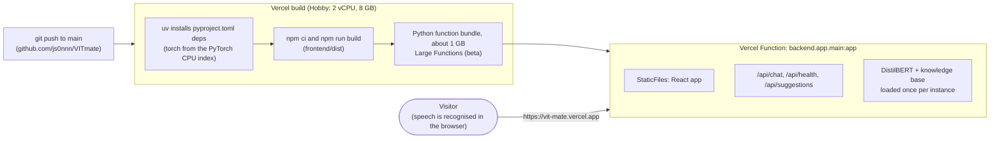

# 10 - Running and Deployment

## Running locally

**Requirements:** Python 3.10+ (tested on 3.12), Node.js 18+ (tested on 20), about 2 GB of disk for the Python packages. No GPU is needed.

### Backend (API + model)

```bash
python3 -m venv .venv
source .venv/bin/activate
pip install -r requirements.txt          # CPU-only PyTorch
uvicorn backend.app.main:app --reload --port 8000
```

`curl http://localhost:8000/api/health` should report `"model_loaded": true`. Interactive API docs are at http://localhost:8000/docs (development only).

### Frontend

```bash
cd frontend
npm install
npm run dev        # http://localhost:5173 (proxies /api to port 8000)
```

Use **Chrome or Edge** for voice input. On Ubuntu, check `node --version`: if it's older than 18, install a newer Node.js (for example with `nvm`) before running `npm install`.

### Single-server mode (production-like)

```bash
cd frontend && npm run build && cd ..
VITMATE_ENV=production uvicorn backend.app.main:app --port 8000
```

When `frontend/dist/` exists, FastAPI serves the built app at `/`, so everything runs on one port.

## Reproducing the ML pipeline

| Step | Command | Output |
|---|---|---|
| Build dataset | `python -m training.build_dataset` | `data/processed/` |
| Compare models | `python -m training.compare_models` then `--only <top-2> --seeds 7 13` | `docs/results/model_comparison.{json,md}` |
| Train final model | `python -m training.train` | `backend/trained_model/` |
| Evaluate | `python -m training.evaluate` | `docs/results/evaluation.{json,md}`, confusion matrix, threshold sweep |
| Graphs | `python -m training.make_graphs` | `docs/graphs/*.png` |
| Diagrams | `PUPPETEER_EXECUTABLE_PATH=/usr/bin/google-chrome python scripts/render_diagrams.py` | `docs/pictures/*.svg, *.png` (needs mermaid-cli) |

Candidate checkpoints go to `artifacts/` (git-ignored, about 1 GB, reproducible).

## Configuration

Copy `.env.example` to `.env`. All settings are optional.

| Variable | Default | Purpose |
|---|---|---|
| `VITMATE_ENV` | `development` | `production` hides the API docs |
| `VITMATE_CONFIDENCE_THRESHOLD` | `0.35` | Below this, VITmate doesn't answer; it offers "did you mean" topics or asks the user to rephrase (value chosen on the validation set) |
| `VITMATE_CORS_ORIGINS` | localhost:5173 | Allowed browser origins (JSON list) |
| `VITMATE_MODEL_DIR`, `VITMATE_KNOWLEDGE_FILE`, `VITMATE_FRONTEND_DIST` | project paths | Relative to the project root |
| `VITMATE_MAX_MESSAGE_LENGTH` | `500` | Input limit |
| `VITMATE_TORCH_THREADS` | unset | Cap CPU threads on small hosts |
| `VITE_API_BASE_URL` (frontend) | empty | Set when the API is on another origin |

## Live deployment (Vercel Hobby, free)

**Live app: https://vit-mate.vercel.app**

VITmate runs as **one Vercel project** (`vit-mate` in the VITmate team, Hobby plan). The FastAPI app, with the trained model and the knowledge base, runs as a single Python Vercel Function, and the same function serves the built React app. API calls stay same-origin under `/api`, so no CORS or `VITE_API_BASE_URL` change is needed. Nothing is uploaded to an external model host, and no paid feature or payment method is used.



### Addresses and access

Vercel gives every deployment several addresses. The project uses Vercel's default **Standard Protection**: the production domain is public, and the other addresses ask for a Vercel login.

| Address | What it is | Public? |
|---|---|---|
| **https://vit-mate.vercel.app** | production domain, always the latest production deployment | **yes**, share this one |
| `https://vit-mate-vit-mate.vercel.app` | team-scoped alias | no (Vercel login) |
| `https://vit-mate-<id>-vit-mate.vercel.app` | an individual deployment | no (Vercel login) |

### How deployments happen

The Vercel project is connected to the GitHub repository. **Every push to `main` starts a Production deployment** automatically, and the production domain switches to it once the build is Ready. A deployment can also be redeployed from the dashboard (**Deployments**, then the deployment's menu, then **Redeploy**). Environment-variable changes only take effect in a new deployment.

### Project settings in use

| Setting | Value |
|---|---|
| Framework Preset | FastAPI |
| Root Directory | `./` (the repository root) |
| Build, Output and Install Command | defaults (overrides **off**); the build step comes from `pyproject.toml` |
| `VITMATE_ENV` | `production` (Secret, Production and Preview): hides `/docs` |
| `VERCEL_SUPPORT_LARGE_FUNCTIONS` | `1` (Config, Production and Preview): enables Large Functions |

A Build Command typed into the dashboard **replaces** the one in `pyproject.toml`, and the frontend would then not be built.

The dashboard rejected `VERCEL_SUPPORT_LARGE_FUNCTIONS` as a variable name, so it was added with the Vercel CLI (run with Node.js 20; the CLI does not start on Node 16):

```bash
vercel link --yes --project vit-mate --scope vit-mate
vercel env add VERCEL_SUPPORT_LARGE_FUNCTIONS production --value 1 --no-sensitive --yes
vercel env add VERCEL_SUPPORT_LARGE_FUNCTIONS preview --value 1 --no-sensitive --yes
vercel env ls production
```

`vercel link` also downloads a `VERCEL_OIDC_TOKEN` into `.env.local`. That file is git-ignored (`.env*`) and isn't needed for this deployment, so it can be deleted.

### Deployment history (24 September 2026)

| Attempt | Result | Why |
|---|---|---|
| 1 | **Error** after 44 s | Bundle of 1,018.56 MB exceeded the standard 500 MB Python limit: Large Functions weren't enabled yet |
| 2 | **Ready** | Redeployed after adding `VERCEL_SUPPORT_LARGE_FUNCTIONS=1`. Build 2 min 8 s plus 41 s post-build on the Hobby build machine (2 vCPU, 8 GB, plan default) |
| later pushes | automatic | each push to `main` builds a new Production deployment |

### Live checks

Checked without a Vercel login against https://vit-mate.vercel.app:

| Check | Result |
|---|---|
| `/` | VITmate page ("VITmate — Your VIT Campus Companion") |
| `/api/health` | `status: ok`, `model_loaded: true`, 38 intents, knowledge retrieved 2026-09-24 |
| `/api/chat` "What is FFCS?" | intent `ffcs`, confidence 0.9225 (identical to the local model) |
| `/docs` | 404 (production mode) |

### How it works

| Piece | Where it's configured | What it does |
|---|---|---|
| Python entrypoint | `pyproject.toml`: `[tool.vercel] entrypoint = "backend.app.main:app"` | Vercel loads the existing FastAPI `app`; its lifespan loads the model and knowledge base once per instance |
| Python version | `.python-version` (`3.12`) and `requires-python` | Pins the tested Python version |
| Runtime dependencies | `[project] dependencies` in `pyproject.toml` (same pins as `backend/requirements.txt`) | Vercel builds with **uv** from `pyproject.toml`, so training and test packages from the root `requirements.txt` are not installed |
| CPU-only PyTorch | `[[tool.uv.index]]` (explicit) + `[tool.uv.sources]` | `torch` comes from the PyTorch CPU index; every other package comes from PyPI |
| Frontend build | `[tool.vercel.scripts] build = "cd frontend && npm ci && npm run build"` | Builds `frontend/dist`, which `backend/app/main.py` serves with `StaticFiles` |
| Bundle contents | `vercel.json`: `functions."backend/app/main.py".excludeFiles` | Leaves docs, training code, raw data, tests and frontend sources out of the function |
| Timeout | `vercel.json`: `maxDuration: 60` | Covers a cold start (Hobby allows up to 300 s) |

### Official limits this relies on (checked 24 September 2026)

| Limit | Hobby value | VITmate |
|---|---|---|
| Python function bundle, standard | 500 MB uncompressed | not enough |
| Python function bundle, [Large Functions](https://vercel.com/docs/functions/limitations#large-functions-beta) (public beta) | up to 5 GB, needs Fluid compute (default for new projects) | **1,019 MiB** (torch 676 MiB, model 129 MiB) |
| [Function memory](https://vercel.com/docs/functions/limitations#memory-size-limits) | 2 GB / 1 vCPU (fixed) | about 690 MB RSS |
| [Max duration](https://vercel.com/docs/functions/limitations#max-duration) | 300 s | set to 60 s |
| [Monthly allotments](https://vercel.com/docs/plans/hobby) | 4 Active CPU hours, 360 GB-hrs provisioned memory, 1M invocations, 100 GB Fast Data Transfer | a query takes about 13 ms of CPU; a cold start a few seconds |
| [Build](https://vercel.com/docs/plans/hobby) | 45 min, 2 vCPU, 8 GB RAM, 32 GB disk | 2 min 8 s build plus 41 s post-build |
| Plan terms | free, non-commercial personal use; if an allotment runs out, the feature pauses until 30 days have passed (no charge) | student lab project |

The bundle is larger than the standard 500 MB limit, so the deployment **depends on Large Functions**. The docs say new projects are eligible by default, but both a local `vercel build` and the first real deployment failed with "Total bundle size (1018.56 MB) exceeds the maximum function size (500 MB)" until `VERCEL_SUPPORT_LARGE_FUNCTIONS=1` was set.

### Verified locally before the first deployment

A clean clone was built with the Vercel CLI builder (`vercel build`, CLI 59.26.0, no deployment):

- Python 3.12 from `.python-version`; dependencies installed with uv from `pyproject.toml`
- `torch 2.14.0+cpu` from download.pytorch.org, `numpy 2.5.3` from PyPI; no CUDA libraries in the bundle
- the bundle contains both safetensors shards, the tokenizer, `data/knowledge/vit_knowledge.yaml` and `frontend/dist`; none of the excluded folders
- the built environment (no scikit-learn, matplotlib or pytest) served `/` (VITmate page and assets), `/api/health` (`model_loaded: true`, 38 intents) and `/api/chat` ("What is FFCS?" as `ffcs`), with `/docs` hidden in production mode; a local cold start took about 3.3 s

### Limitations

- **Large Functions are a beta feature.** If Vercel changes it, the torch-based bundle would no longer fit the standard 500 MB limit.
- **Cold starts include the page itself.** The frontend is served by the function rather than the CDN (Vercel does not promote a root `StaticFiles` mount), so the first visit after the app has been idle waits for the function to start, import PyTorch and load the model. Expect several seconds; later requests are fast.
- **Runtime logs** are kept for 1 hour on Hobby.
- Vercel serves the site over **HTTPS**, which browsers require for microphone access.
- The weights are two shards (85 MB + 48 MB), each under GitHub's 100 MB per-file limit, so Git LFS isn't required.

### Deployment-friendly properties of the code

- **No machine-specific paths:** everything is project-relative or set through `VITMATE_*` variables.
- **Stateless API:** conversation context round-trips through the client, and chat history lives in the user's browser (IndexedDB), so no database is needed.
- **Errors never expose stack traces or file paths**, and `VITMATE_ENV=production` disables `/docs`.
