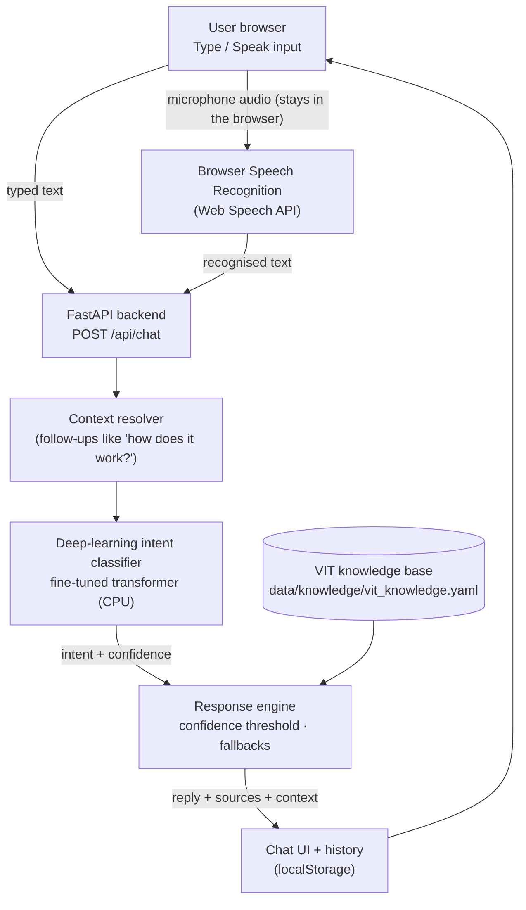
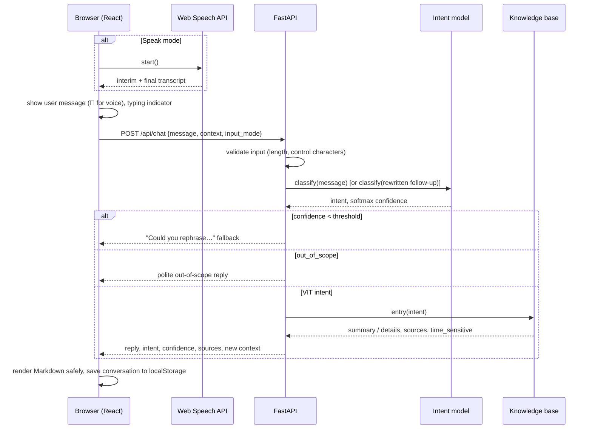

# VITmate — System Architecture

VITmate has three parts:

1. a **browser client** that handles typing, speech recognition and conversation history
2. a **stateless Python API** that runs the deep-learning intent classifier and the response engine
3. a **curated knowledge base** of official VIT information

Deciding *what* the user asks about (the neural network) is kept separate from *what VITmate answers* (the knowledge base). Facts can therefore be updated without retraining the model.

## High-level flow



The same diagram in plain text:

```text
                ┌─────────────────────┐
                │     User Browser    │
                │ Type / Speak Input  │
                └──────────┬──────────┘
                           │
                           ▼
                ┌─────────────────────┐
                │ Speech Recognition  │   (Speak mode only; runs in the browser)
                │   Web Speech API    │
                └──────────┬──────────┘
                           │ recognised text
                           ▼
                ┌─────────────────────┐
                │  FastAPI  /api/chat │
                └──────────┬──────────┘
                           ▼
                ┌─────────────────────┐
                │ Deep Learning Model │   fine-tuned transformer
                │  Intent Classifier  │   (loaded once at startup)
                └──────────┬──────────┘
                           │ intent + confidence
                           ▼
                ┌─────────────────────┐
                │ VIT Knowledge Base  │   YAML, official sources
                │ + Response Engine   │   threshold, context, fallbacks
                └──────────┬──────────┘
                           ▼
                ┌─────────────────────┐
                │ Assistant Response  │
                └──────────┬──────────┘
                           ▼
                ┌─────────────────────┐
                │ Chat UI + History   │   localStorage
                └─────────────────────┘
```

## Request lifecycle



## Components

| Layer | Location | Responsibility |
|---|---|---|
| Speech recognition | `frontend/src/hooks/useSpeechRecognition.ts` | Wraps the browser's `SpeechRecognition` (states: idle, listening, processing, success, error; all error codes mapped to helpful messages) |
| Chat UI | `frontend/src/components/*` | Sidebar history, Type/Speak segmented control, message thread, About modal, themes |
| Persistence | `frontend/src/hooks/useConversations.ts`, `services/storage.ts` | Conversations, theme and input mode kept in `localStorage` |
| API | `backend/app/api/` | `GET /api/health`, `GET /api/suggestions`, `POST /api/chat`; validation and error mapping |
| Intent model | `backend/app/ml/intent_classifier.py` | Loads the fine-tuned transformer once and returns the intent, confidence and alternatives |
| Context | `backend/app/chatbot/context.py` | Detects follow-ups ("tell me more", "how does it work?") and rewrites pronouns with the current topic |
| Response engine | `backend/app/chatbot/engine.py` | Applies the confidence threshold, routes to the knowledge base or conversational replies, and asks for clarification when unsure |
| Knowledge base | `data/knowledge/vit_knowledge.yaml`, `backend/app/knowledge/` | Official VIT facts, each entry with sources, a verification date and a time-sensitivity flag |
| Training | `training/` | Dataset build, model comparison, final training, evaluation |

## Conversation context (stateless server)

The server keeps **no session state**. Every reply contains a small `context` object:

```json
{ "previous_intent": "ffcs", "depth": 0 }
```

The browser stores it with the conversation and sends it back with the next message. When the next message is a follow-up:

- **Continuation** ("tell me more", "elaborate") → the entry's `details` for the current topic.
- **Pronoun follow-up** ("How does it work?") → rewritten as "How does FFCS work?" and re-classified. If the model confirms the topic with confidence above the threshold, VITmate returns the details. If the message clearly names a different topic, it answers that topic. Otherwise it asks the user to clarify rather than guess.
- Greetings and thanks don't reset the topic.

Because nothing is stored on the server, the API scales horizontally and survives restarts, which suits free hosting tiers.

## Why these technologies

| Decision | Reason |
|---|---|
| Browser Web Speech API | No installation for users; no audio uploaded to VITmate's server; no server-side speech-to-text cost. Best accuracy in Chromium browsers. |
| FastAPI + Uvicorn | Lightweight, typed request validation, automatic docs in development |
| Fine-tuned small transformer | Genuine deep learning; best measured macro-F1; fast on CPU (see `docs/results/`) |
| YAML knowledge base | Human-editable, versionable, no database needed; updates need no retraining |
| React + Vite + TypeScript | Fast development, small production bundle, typed components |
| `localStorage` for history | No accounts or database; chats stay private to the user's browser |

## Deployment readiness

- All paths are project-relative or set through `VITMATE_*` environment variables (`.env.example`).
- The model is loaded once at startup. CPU is enough, and the thread count can be capped with `VITMATE_TORCH_THREADS`.
- If `frontend/dist/` exists, FastAPI serves the built frontend, so a **single service** can host the whole app. Alternatively, host the static frontend separately and set `VITE_API_BASE_URL` and `VITMATE_CORS_ORIGINS`.
- `VITMATE_ENV=production` disables the interactive API docs. Errors never expose stack traces or file paths.
