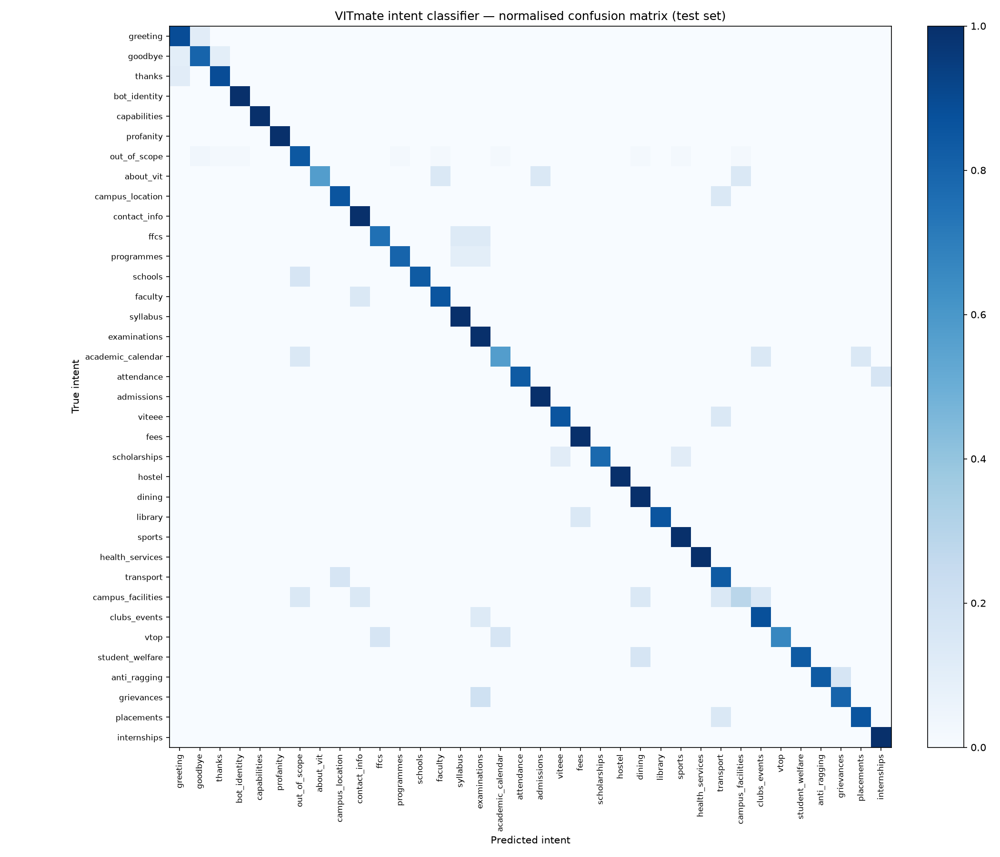
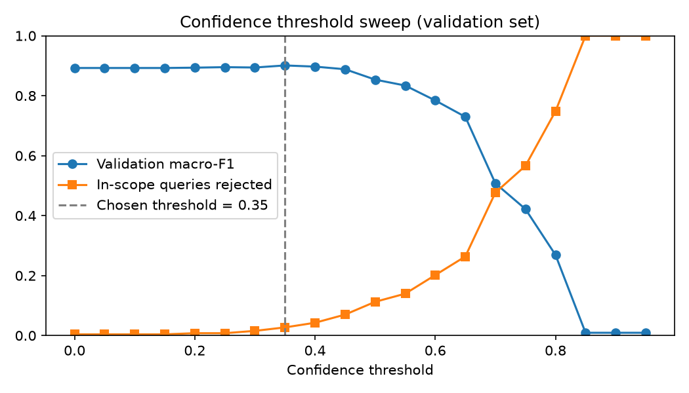

# VITmate intent model — evaluation

Generated by `python -m training.evaluate`. Model: `BAAI/bge-small-en-v1.5` (33.4M parameters, 36 intents).

## Classification metrics (arg-max prediction, no threshold)

| Set | Accuracy | Macro P | Macro R | Macro F1 | Weighted P | Weighted R | Weighted F1 |
|---|---|---|---|---|---|---|---|
| Test (n=319) | 0.8589 | 0.8569 | 0.8603 | 0.8490 | 0.8718 | 0.8589 | 0.8573 |
| Spoken-style challenge (n=113) | 0.9558 | 0.9630 | 0.9560 | 0.9552 | 0.9624 | 0.9558 | 0.9550 |

## With the confidence threshold (0.35)

Predictions below the threshold are answered with a "please rephrase" fallback and counted as `out_of_scope` here. The threshold was chosen on the validation set.

| Set | Accuracy | Macro P | Macro R | Macro F1 | Weighted P | Weighted R | Weighted F1 |
|---|---|---|---|---|---|---|---|
| Test | 0.8589 | 0.8809 | 0.8573 | 0.8596 | 0.8675 | 0.8589 | 0.8556 |
| Spoken-style challenge | 0.9558 | 0.9736 | 0.9560 | 0.9588 | 0.9659 | 0.9558 | 0.9545 |

- In-scope test queries rejected as low-confidence: 5.10%
- **Out-of-scope recall** on 983 held-out CLINC150 out-of-scope queries: 85.05% (arg-max) / 89.93% (with threshold)

## Efficiency (CPU)

- Model load time: 0.15 s
- Single-query latency: median 8.02 ms, mean 8.07 ms, p95 9.17 ms
- Process memory (RSS) after loading and inference: 683.6 MB
- Model size on disk: 67.7 MB

## Per-intent results (test set)

| Intent | Precision | Recall | F1 | Support |
|---|---|---|---|---|
| greeting | 0.800 | 0.889 | 0.842 | 9 |
| goodbye | 0.727 | 0.800 | 0.762 | 10 |
| thanks | 0.800 | 0.889 | 0.842 | 9 |
| bot_identity | 0.917 | 1.000 | 0.957 | 11 |
| capabilities | 1.000 | 1.000 | 1.000 | 8 |
| profanity | 1.000 | 1.000 | 1.000 | 4 |
| out_of_scope | 0.947 | 0.844 | 0.893 | 64 |
| about_vit | 1.000 | 0.571 | 0.727 | 7 |
| campus_location | 0.857 | 0.857 | 0.857 | 7 |
| contact_info | 0.750 | 1.000 | 0.857 | 6 |
| ffcs | 0.857 | 0.750 | 0.800 | 8 |
| programmes | 0.889 | 0.800 | 0.842 | 10 |
| schools | 1.000 | 0.833 | 0.909 | 6 |
| faculty | 0.750 | 0.857 | 0.800 | 7 |
| syllabus | 0.750 | 1.000 | 0.857 | 6 |
| examinations | 0.667 | 1.000 | 0.800 | 8 |
| academic_calendar | 0.667 | 0.571 | 0.615 | 7 |
| attendance | 1.000 | 0.833 | 0.909 | 6 |
| admissions | 0.889 | 1.000 | 0.941 | 8 |
| viteee | 0.857 | 0.857 | 0.857 | 7 |
| fees | 0.900 | 1.000 | 0.947 | 9 |
| scholarships | 1.000 | 0.778 | 0.875 | 9 |
| hostel | 1.000 | 1.000 | 1.000 | 9 |
| dining | 0.727 | 1.000 | 0.842 | 8 |
| library | 1.000 | 0.857 | 0.923 | 7 |
| sports | 0.750 | 1.000 | 0.857 | 6 |
| health_services | 1.000 | 1.000 | 1.000 | 6 |
| transport | 0.556 | 0.833 | 0.667 | 6 |
| campus_facilities | 0.500 | 0.286 | 0.364 | 7 |
| clubs_events | 0.778 | 0.875 | 0.824 | 8 |
| vtop | 1.000 | 0.667 | 0.800 | 6 |
| student_welfare | 1.000 | 0.833 | 0.909 | 6 |
| anti_ragging | 1.000 | 0.833 | 0.909 | 6 |
| grievances | 0.800 | 0.800 | 0.800 | 5 |
| placements | 0.857 | 0.857 | 0.857 | 7 |
| internships | 0.857 | 1.000 | 0.923 | 6 |

## Misclassified test examples

| Text | True | Predicted | Confidence |
|---|---|---|---|
| when are the winter vacations | academic_calendar | out_of_scope | 0.93 |
| where can I get a xerox | campus_facilities | out_of_scope | 0.90 |
| what is SENSE | schools | out_of_scope | 0.89 |
| when do classes start | out_of_scope | academic_calendar | 0.81 |
| what if I miss classes during an internship | attendance | internships | 0.80 |
| is there a supermarket on campus | campus_facilities | dining | 0.79 |
| does VIT give scholarships for sports | scholarships | sports | 0.79 |
| alright cool | thanks | greeting | 0.75 |
| nice to see you again | goodbye | greeting | 0.73 |
| is there any scholarship for first rank holders in VITEEE | scholarships | viteee | 0.72 |
| what courses does IIT Madras offer | out_of_scope | programmes | 0.71 |
| what is the next football game | out_of_scope | sports | 0.70 |
| how much food should i feed my cat | out_of_scope | dining | 0.69 |
| Do you love me | out_of_scope | bot_identity | 0.68 |
| does VIT have a post office | campus_facilities | contact_info | 0.68 |
| namaste | greeting | goodbye | 0.65 |
| uh what should I do if seniors harass me | anti_ragging | grievances | 0.65 |
| I'm a day scholar, how do I come to college every day | transport | campus_location | 0.63 |
| what is the fine for late return | library | fees | 0.60 |
| take it easy! | goodbye | thanks | 0.59 |
| kindly tell me how to reach the HOD | faculty | contact_info | 0.57 |
| who is the vice chancellor of VIT | about_vit | faculty | 0.56 |
| who are some notable alumni of ucsd | out_of_scope | faculty | 0.55 |
| um uh er | out_of_scope | goodbye | 0.55 |
| is there a VIT campus in Chennai | about_vit | campus_facilities | 0.54 |
| what workshops and labs are open to students | campus_facilities | clubs_events | 0.51 |
| blah blah | out_of_scope | goodbye | 0.50 |
| when is Riviera holiday | academic_calendar | clubs_events | 0.47 |
| how many firewalls should i have and what type | out_of_scope | campus_facilities | 0.44 |
| how do I travel to VIT from Bangalore | campus_location | transport | 0.43 |
| are there off campus placement drives | placements | transport | 0.43 |
| what is the curriculum credit requirement for BTech | ffcs | syllabus | 0.43 |
| what is the add drop period | ffcs | examinations | 0.42 |
| is there a courier service on campus | campus_facilities | transport | 0.35 |
| when is gravitas this year | clubs_events | examinations | 0.35 |
| what are the BTech specializations | programmes | syllabus | 0.33 |
| where do I see announcements from the university | vtop | academic_calendar | 0.29 |
| how many students study at VIT | about_vit | admissions | 0.28 |
| I love you | out_of_scope | thanks | 0.28 |
| I'm homesick what can I do | student_welfare | dining | 0.24 |
| AI/Ml | programmes | examinations | 0.23 |
| when do freshers join | academic_calendar | placements | 0.23 |
| uh tell me about the VIT entrance test | viteee | transport | 0.23 |
| v top portal | vtop | ffcs | 0.21 |
| what is the process to appeal a decision | grievances | examinations | 0.18 |
