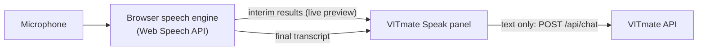

# Speech Recognition in VITmate

VITmate uses **browser-native speech recognition** through the **Web Speech API** (`SpeechRecognition`, exposed as `webkitSpeechRecognition` in Chromium browsers). Users don't need to install anything. They open the site, switch to **Speak**, allow the microphone and talk.

## How it works

1. The user clicks the microphone. `useSpeechRecognition.start()` creates a recognition object with:
   - `lang = "en-IN"` (Indian English, suited to VIT students' accents and vocabulary)
   - `interimResults = true` (the words appear live while the user speaks)
   - `continuous = false` (a single utterance; recognition ends automatically after a pause)
2. The browser asks for microphone permission the first time.
3. While listening, the UI shows pulsing rings, an animated waveform and the live transcript.
4. When the user stops speaking (or presses the stop button), the browser returns the **final transcript**.
5. The transcript is sent through **the same `handleSend()` function as typed text**, with `input_mode: "voice"`. It appears in the conversation as the user's message with a 🎤 marker, and the reply follows. There is **no separate voice chatbot**.

**Privacy note.** VITmate's server receives only the recognised text, never audio. In Chrome and Edge, however, the browser itself sends audio to the browser vendor's cloud speech service to perform recognition. So recognition needs an internet connection, and the vendor's privacy policy applies to it.

## States

| State | Meaning | UI |
|---|---|---|
| `idle` | Ready | Blue microphone, "Tap the microphone and ask your question" |
| `listening` | Capturing speech | Red stop button, pulsing rings, waveform, live transcript, Cancel link |
| `processing` | Finalising after stop | Spinner |
| `success` | Transcript captured and sent | Green check, then back to `idle` after about 1.2 s so the user can speak again |
| `error` | Something went wrong | Red message explaining how to fix it; tapping the microphone retries |

## Error handling

| Situation | Detection | Message shown |
|---|---|---|
| Browser without the API (e.g. Firefox) | no `SpeechRecognition` constructor | "Speech recognition isn't supported in this browser. Please use Google Chrome or Microsoft Edge, or switch to Type mode." (with a *Switch to Type* button) |
| Page not served over HTTPS/localhost | `window.isSecureContext === false` | "Voice input needs a secure (https) connection or localhost." |
| Microphone permission denied | `not-allowed` / `service-not-allowed` | How to re-enable the microphone from the address bar |
| No microphone | `audio-capture` | "No microphone was found…" |
| Silence / nothing recognised | `no-speech`, or an empty final transcript | "I didn't catch anything…" (nothing is sent) |
| Speech service unreachable | `network` | "The browser's speech service couldn't be reached. Check your internet connection…" |
| Unsupported language | `language-not-supported` | Explanation |
| User cancels | `abort()` with handlers detached | Returns to idle silently |
| Repeated clicks | Guard in `start()` | Only one recognition session runs at a time |

## Browser support

| Browser | Status |
|---|---|
| Google Chrome (desktop and Android) | ✅ Supported (recommended) |
| Microsoft Edge | ✅ Supported |
| Safari (macOS/iOS) | ⚠️ Partial. Exposes `webkitSpeechRecognition`, but behaviour varies by version |
| Firefox | ❌ Not supported; VITmate shows the unsupported message and Type mode keeps working |
| Brave / some Chromium forks | ⚠️ The API may exist but fail with a `network` error; VITmate reports it |

## Testing voice input

- Automated: `frontend/src/test/components.test.tsx` mocks `SpeechRecognition` to test the listening state, sending the transcript, a blocked microphone, silence and the unsupported-browser message.
- Manual: open http://localhost:5173 in Chrome, switch to **Speak** and say, for example, "What are the hostel facilities at VIT?". The recognised text appears with a 🎤 marker, followed by VITmate's answer.
